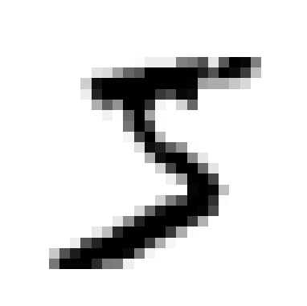

# Machine Learning Notes

## Classification

To download the MNIST dataset, I am importing `sklearn.datasets.fetch_openml`.

```py
from sklearn.datasets import fetch_openml

mnist = fetch_openml('mnist_784', version=1)
```

Saved dataset is cached at `"C:\Users\HP\scikit_learn_data"`.

Datasets loaded by scikit-learn generally have similar folder structure `mnist.keys() = ['data', 'target', 'frame', 'categories', 'feature_names', 'target_names', 'DESCR', 'details', 'url']`.

- _DESCR_: Holds the description of the dataset.
- _data_: Holds an array with the x values of the dataset. Each row represents a single sample and each column is a feature.
- _target_: Holds an array of the labels for each x.

```py
mnist['DESCR']
```

To get the `x` and `y`, you can do the following -

```py
x, y = mnist['data'], mnist['target']
```

If you look at the shape of `x` and `y` then you will see there are `70,000` samples. Each sample has `784` features. It is because the samples are images with dimention `28 X 28`. Each value is representing the intensity of the pixel that is from 0(white) to 255(black).

For each sample there are labels, so total `70,000` labels.

```py
x.shape, y.shape
```

Output:

```
(70000, 784), (70000, )
```

Now, let's pick a sample and it's label to see how the dataset looks like in the inside.

In this dataset, `x` is of type `pandas.core.frame.DataFrame` and `y` is of `pandas.core.series.Series` type.

So, to get values using index you have to use `to_numpy()` method.

In this code, I am trying to look at one of the sample digit images.

```py
import matplotlib.pyplot as plt

sample_example = X.to_numpy()[0]
sample_example_img = sample_example.reshape(28, 28)
plt.imshow(sample_example_img, cmap='binary')
plt.axis("off")
plt.show()
```

Output:



The sample digit looks like a 5. And if I look at the target value for this sample in `y`, I see that it is indeed 5.

```py
y[0]
```

```
'5'
```

But, closely look at the result ans you will see it is a string.

Machine learning models always deals with integer values, so it is necessary to change the label type from string to integer.

To cast the labels from string to number-

```py
import numpy as np
y = y.astype(np.uint8)
```

MNIST dataset are already shuffled so I can just slice the train and test set from the dataset. Shuffled data is important because you don't want one of your cross-validation folds to miss some digits. Some learning algorithms are sensitive to the order of the instances and perform poorly if same instances are repeated in a row. Although there are exceptions like when working with time-series data.

```py
x_train, y_train, x_test, y_test = X[:60000], y[:60000], X[60000:], y[60000:]
```

We can make this problem a binary classification problem by making the classes only 5 and not-5. This "5-detector" is a binary classifier as it classifies the result between 2 classes.

_SGDClassifier_: For instances when we need a model that can handle large datasets efficiently, we can use Stochastic Gradient Descent(SGD) classifier as it deals with each instance independently, one at a time (which also makes it well suited for online training).
