# Generative AI and Large Language Models

## Introduction

Large language models or LLMs are a very exciting technology. But despite all the buzz and hype, one of the thing that is still underestimated by many people is their power as a developer tool.

Specifically, there are many machine learning and AI applications that used to take many months to build that you can now build in days or maybe even small numbers of weeks. This note will take a deep dive with you into how LLM technology actually works including going through many of the technical details, like model training, instruction tuning, fine-tuning, the generative AI project life cycle framework to help you plan and execute your projects and so on.

Generative AI and LLMs specifically are a general purpose technology. That means that similar to other general purpose technologies like deep learning and electricity, is useful not just for a single application, but for a lot of different applications that span many corners of the economy.

The first section will share with you a deep dive into how transformer networks actually work. In 2017, the paper came out, Attention is all You Need, and it laid out all of these fairly complex data processes which are going to happen inside the transformer architecture. So we take a little bit of a high level view, but we do go down into some depths. We talk about things like self-attention and the multi-headed self-attention mechanism. So we can see why it is that these models actually work, how it is that they actually gain an understanding of language.

It's been really interesting to see how that basic transformer architecture is creating a foundation for vision transformers as well. Understanding transformers is also helping people understand this really exciting vision transformer and other modalities as well. It's going to be a really critical building block for a lot of machine learning.

Then comes the Generative AI project Lifecycle which walks you through the individual stages and decisions you have to make when you're developing Generative AI applications. So one of the first things you have to decide is whether you're taking a foundation model off the shelf or you're actually pre-training your own model and then as a follow up, whether you want to fine tune and customize that model maybe for your specific data.

There might be use cases where you really need the model to be very comprehensive and able to generalize to a lot of different tasks. And there might be use cases where you're just optimizing for a single-use case, right? And you can potentially work with a smaller model and achieving similar or even very good results. When you want your large language model to have a lot of general knowledge about the world, when you wanted to know stuff about history and philosophy and the sizes and how to write Python code and so on and so on. It helps to have a giant model with hundreds of billions of parameters. But for a single task like summarizing dialogue or acting as a customer service agent for one company, for applications like that, sometimes you can use hundreds of billions of parameters models. But that's not always necessary.

We'll talk about large language models, their use cases, how the models work, prompt engineering, how to make creative text outputs, and outline a project lifecycle for generative AI projects.

## Foundation models

Whether it be a chat bot, generating images from text, or using a plugin to help you develop code, what you see in these tools is a machine that is capable of creating content that mimics or approximates human ability.

Generative AI is a subset of traditional machine learning. And the machine learning models that underpin generative AI have learned these abilities by finding statistical patterns in massive datasets of content that was originally generated by humans. Large language models have been trained on trillions of words over many weeks and months, and with large amounts of compute power. These foundation models, as we call them, with billions of parameters, exhibit emergent properties beyond language alone, and researchers are unlocking their ability to break down complex tasks, reason, and problem solve.

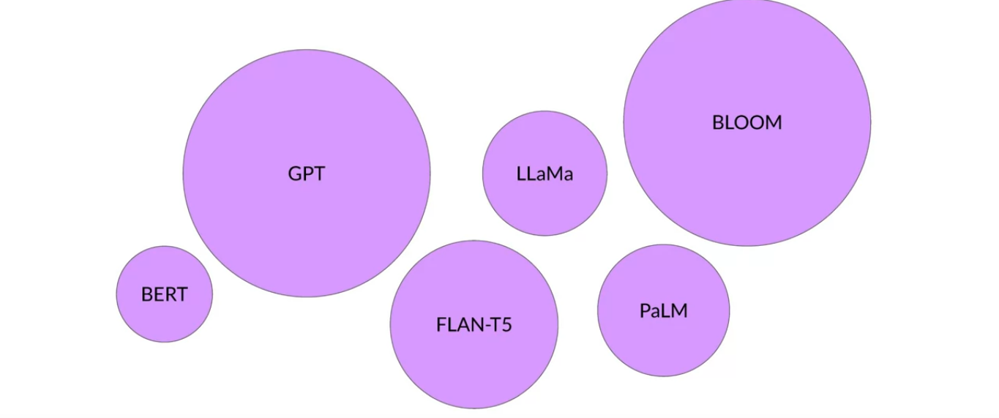

Here are a collection of foundation models, sometimes called base models, and their relative size in terms of their parameters. You can think of them as the model's memory. And the more parameters a model has, the more memory, and as it turns out, the more sophisticated the tasks it can perform.

By either using these models as they are or by applying fine tuning techniques to adapt them to your specific use case, you can rapidly build customized solutions without the need to train a new model from scratch.

Now, while generative AI models are being created for multiple modalities, including images, video, audio, and speech, you'll focus on large language models and their uses in natural language generation. You will see how they are built and trained, how you can interact with them via text known as prompts. And how to fine tune models for your use case and data, and how you can deploy them with applications to solve your business and social tasks.

The way you interact with language models is quite different than other machine learning and programming paradigms. In those cases, you write computer code with formalized syntax to interact with libraries and APIs.

In contrast, large language models are able to take natural language or human written instructions and perform tasks much as a human would. The text that you pass to an LLM is known as a `prompt`. The space or memory that is available to the prompt is called the `context window`, and this is typically large enough for a few thousand words, but differs from model to model.

In this example, you ask the model to determine `where Ganymede is located in the solar system?`. The prompt is passed to the model, the model then predicts the next words, and because your prompt contained a question, this model generates an answer. The output of the model is called a `completion`, and the act of using the model to generate text is known as `inference`. The completion is comprised of the text contained in the original prompt, followed by the generated text.

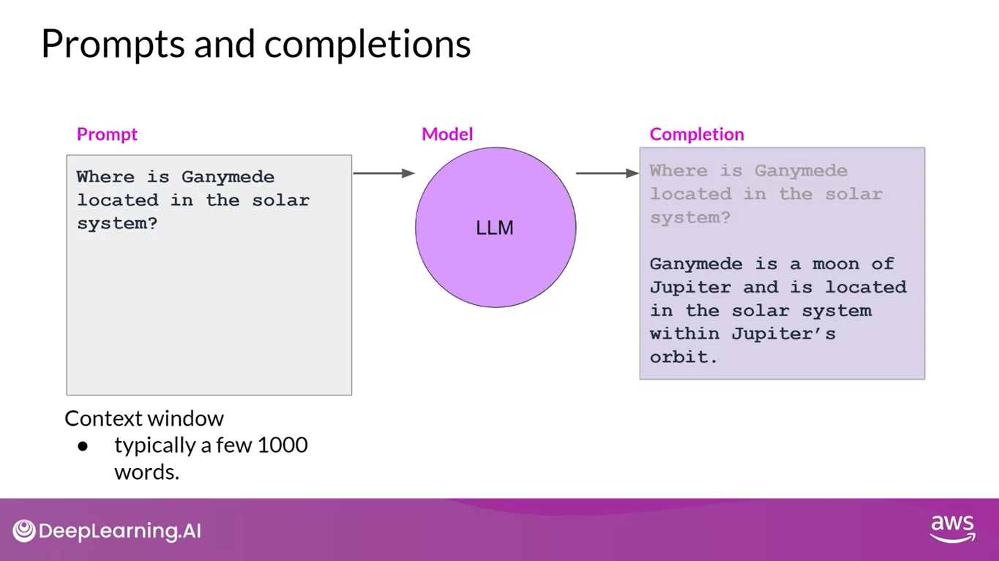

## Use cases of LLMs

LLMs and generative AI are focused on chats tasks. After all, chatbots are highly visible and getting a lot of attention. Next word prediction is the base concept behind a number of different capabilities, starting with a basic chatbot.

However, you can use this conceptually simple technique for a variety of other tasks within text generation.

For example, you can ask a model to write an essay based on a prompt, to summarize conversations where you provide the dialogue as part of your prompt and the model uses this data along with its understanding of natural language to generate a summary.

You can use models for a variety of translation tasks from traditional translation between two different languages, such as French and German, or English and Spanish.

Or to translate natural language to machine code. For example, you could ask a model to "write some Python code that will return the mean of every column in a DataFrame" and the model will generate code that you can pass to an interpreter.

You can use LLMs to carry out smaller, focused tasks like information retrieval. In this example, you ask the model to identify all of the people and places identified in a news article. This is known as `named entity recognition`, a word classification. The understanding of knowledge encoded in the model's parameters allows it to correctly carry out this task and return the requested information to you.

Finally, an area of active development is augmenting LLMs by connecting them to external data sources or using them to invoke external APIs. You can use this ability to provide the model with information it doesn't know from its pre-training and to enable your model to power interactions with the real-world.

Developers have discovered that as the scale of foundation models grows from hundreds of millions of parameters to billions, even hundreds of billions, the subjective understanding of language that a model possesses also increases.

This language understanding stored within the parameters of the model is what processes, reasons, and ultimately solves the tasks you give it, but it's also true that smaller models can be fine tuned to perform well on specific focused tasks.

## Text Generation before transformers

It's important to note that generative algorithms are not new. Previous generations of language models made use of an architecture called recurrent neural networks or RNNs.

RNNs while powerful for their time, were limited by the amount of compute and memory needed to perform well at generative tasks. Let's look at an example of an RNN carrying out a simple next-word prediction generative task.

```
...tastes ?
...tea tastes ?
..., my tea tastes (great) - Prediction
[The milk was bad], so the tea tastes (great) X
```

With just one previous words seen by the model, the prediction can't be very good. As you scale the RNN implementation to be able to see more of the preceding words in the text, you have to significantly scale the resources that the model uses. As for the prediction, well, the model failed here.

Even though you scale the model, it still hasn't seen enough of the input to make a good prediction. To successfully predict the next word, models need to see more than just the previous few words. Models needs to have an understanding of the whole sentence or even the whole document.

The problem here is that language is complex. In many languages, one word can have multiple meanings. These are homonyms.

```
I took my money to (bank).
```

In this case, it's only with the context of the sentence that we can see what kind of bank is meant.

Words within a sentence structures can be ambiguous or have what we might call syntactic ambiguity. Take for example this sentence,

```
The teacher taught the students with the book.
```

Did the teacher teach using the book or did the student have the book, or was it both? How can an algorithm make sense of human language if sometimes we can't?

In 2017, after the publication of this paper, `Attention is All You Need`, from Google and the University of Toronto, everything changed. The transformer architecture had arrived. This novel approach unlocked the progress in generative AI that we see today.

It can be scaled efficiently to use multi-core GPUs, it can parallel process input data, making use of much larger training datasets, and crucially, it's able to learn to pay attention to the meaning of the words it's processing. And attention is all you need.

## Transformers

Building large language models using the transformer architecture dramatically improved the performance of natural language tasks over the earlier generation of RNNs, and led to an explosion in regenerative capability.

The power of the transformer architecture lies in its ability to learn the relevance and context of all of the words in a sentence. Not just as you see here, to each word next to its neighbor, but to every other word in a sentence.


To apply attention weights to those relationships so that the model learns the relevance of each word to each other words no matter where they are in the input. This gives the algorithm the ability to learn who has the book, who could have the book, and if it's even relevant to the wider context of the document.

These attention weights are learned during LLM training and you'll learn more about this later this week. This diagram is called an attention map and can be useful to illustrate the attention weights between each word and every other word. Here in this stylized example, you can see that the word book is strongly connected with or paying attention to the word teacher and the word student. This is called self-attention and the ability to learn attension in this way across the whole input significantly approves the model's ability to encode language.


Now that you've seen one of the key attributes of the transformer architecture, self-attention, let's cover at a high level how the model works.

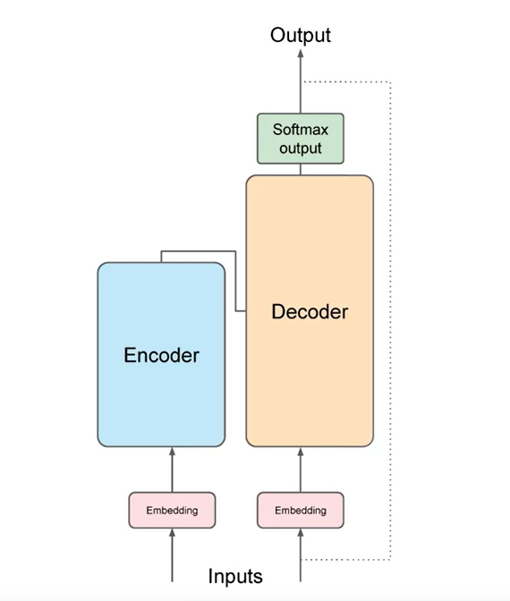

Here's a simplified diagram of the transformer architecture so that you can focus at a high level on where these processes are taking place.

The transformer architecture is split into two distinct parts, the encoder and the decoder.

These components work in conjunction with each other and they share a number of similarities.

Also, note here, the diagram you see is derived from the original attention is all you need paper. Notice how the inputs to the model are at the bottom and the outputs are at the top.

Now, machine-learning models are just big statistical calculators and they work with numbers, not words. So before passing texts into the model to process, you must first tokenize the words.

Simply put, this converts the words into numbers, with each number representing a position in a dictionary of all the possible words that the model can work with.

You can choose from multiple tokenization methods. For example, token IDs matching to complete words, or using token IDs to represent parts of words. What's important is that once you've selected a tokenizer to train the model, you must use the same tokenizer when you generate text.

Now that your input is represented as numbers, you can pass it to the embedding layer.

This layer is a trainable vector embedding space, a high-dimensional space where each token is represented as a vector and occupies a unique location within that space.

Each token ID in the vocabulary is matched to a multi-dimensional vector, and the intuition is that these vectors learn to encode the meaning and context of individual tokens in the input sequence.

Embedding vector spaces have been used in natural language processing for some time, previous generation language algorithms like Word2vec use this concept.

Looking back at the sample sequence, you can see that in this simple case, each word has been matched to a token ID, and each token is mapped into a vector.

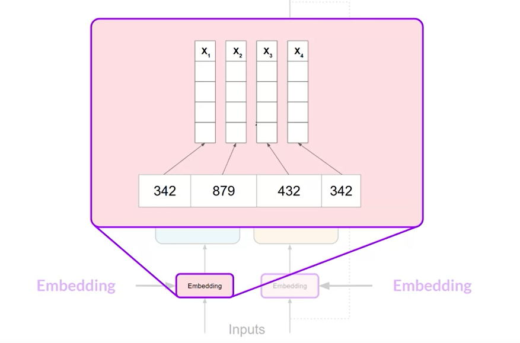

In the original transformer paper, the vector size was actually 512, so much bigger than we can fit onto this image. For simplicity, if you imagine a vector size of just three, you could plot the words into a three-dimensional space and see the relationships between those words.

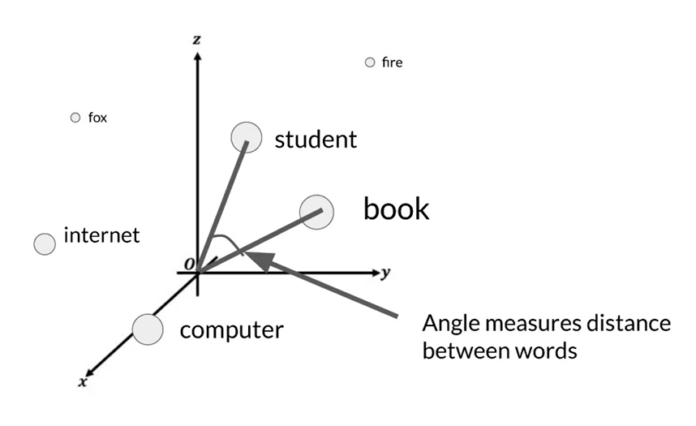

You can see now how you can relate words that are located close to each other in the embedding space, and how you can calculate the distance between the words as an angle, which gives the model the ability to mathematically understand language.

As you add the token vectors into the base of the encoder or the decoder, you also add positional encoding. The model processes each of the input tokens in parallel. So by adding the positional encoding, you preserve the information about the word order and don't lose the relevance of the position of the word in the sentence.

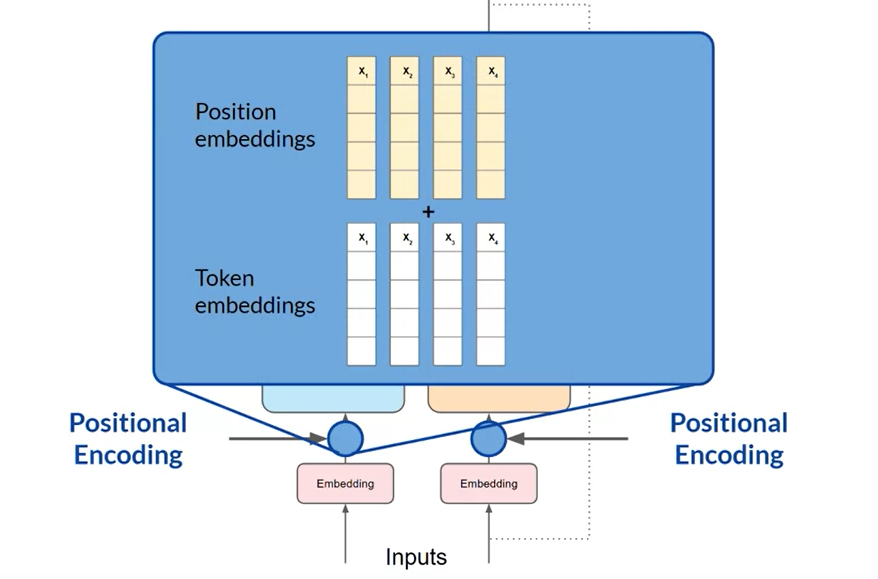

Once you've summed the input tokens and the positional encodings, you pass the resulting vectors to the self-attention layer. Here, the model analyzes the relationships between the tokens in your input sequence.

As you saw earlier, this allows the model to attend to different parts of the input sequence to better capture the contextual dependencies between the words.

The self-attention weights that are learned during training and stored in these layers reflect the importance of each word in that input sequence to all other words in the sequence.

But this does not happen just once, the transformer architecture actually has multi-headed self-attention. This means that multiple sets of self-attention weights or heads are learned in parallel independently of each other.

The number of attention heads included in the attention layer varies from model to model, but numbers in the range of 12-100 are common.

The intuition here is that each self-attention head will learn a different aspect of language. For example, one head may see the relationship between the people entities in our sentence. Whilst another head may focus on the activity of the sentence. Whilst yet another head may focus on some other properties such as if the words rhyme.

It's important to note that you don't dictate ahead of time what aspects of language the attention heads will learn. The weights of each head are randomly initialized and given sufficient training data and time, each will learn different aspects of language.

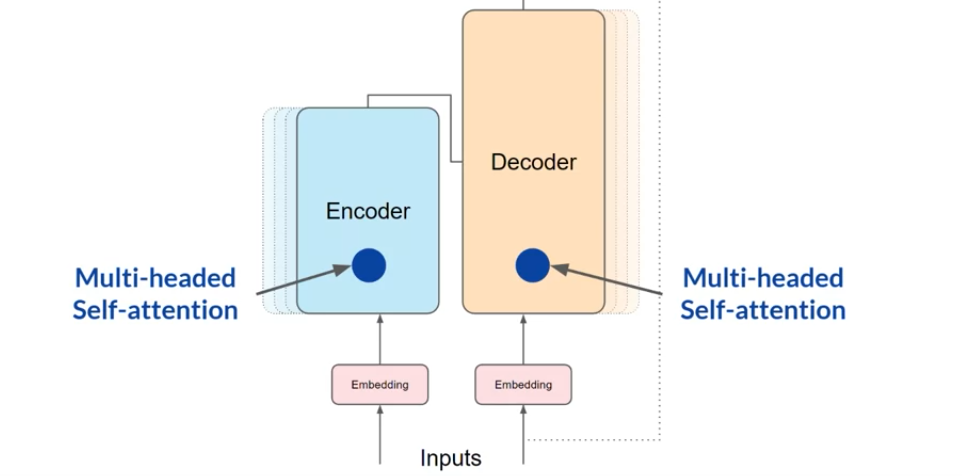

While some attention maps are easy to interpret, like the examples discussed here, others may not be.

Now that all of the attention weights have been applied to your input data, the output is processed through a fully-connected feed-forward network.

The output of this layer is a vector of logits proportional to the probability score for each and every token in the tokenizer dictionary.

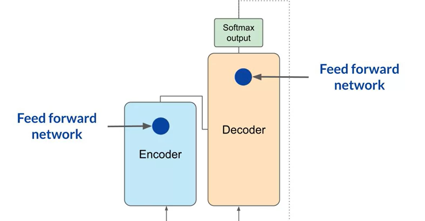

You can then pass these logits to a final softmax layer, where they are normalized into a probability score for each word.

This output includes a probability for every single word in the vocabulary, so there's likely to be thousands of scores here. One single token will have a score higher than the rest. This is the most likely predicted token.

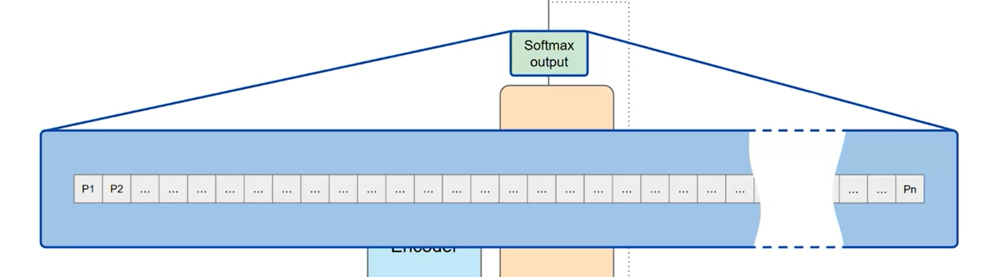

## Example of transfomer working on text

At this point, you've seen a high-level overview of some of the major components inside the transformer architecture. But you still haven't seen how the overall prediction process works from end to end.

Let's walk through a simple example. In this example, you'll look at a translation task or a sequence-to-sequence task, which incidentally was the original objective of the transformer architecture designers.

You'll use a transformer model to translate the French phrase into English.

First, you'll tokenize the input words using this same tokenizer that was used to train the network.

These tokens are then added into the input on the encoder side of the network, passed through the embedding layer, and then fed into the multi-headed attention layers.

The outputs of the multi-headed attention layers are fed through a feed-forward network to the output of the encoder.

At this point, the data that leaves the encoder is a deep representation of the structure and meaning of the input sequence.

This representation is inserted into the middle of the decoder to influence the decoder's self-attention mechanisms.

Next, a start of sequence token is added to the input of the decoder.

This triggers the decoder to predict the next token, which it does based on the contextual understanding that it's being provided from the encoder.

The output of the decoder's self-attention layers gets passed through the decoder feed-forward network and through a final softmax output layer.

At this point, we have our first token.

You'll continue this loop, passing the output token back to the input to trigger the generation of the next token, until the model predicts an end-of-sequence token.

At this point, the final sequence of tokens can be detokenized into words, and you have your output. In this case, I love machine learning.

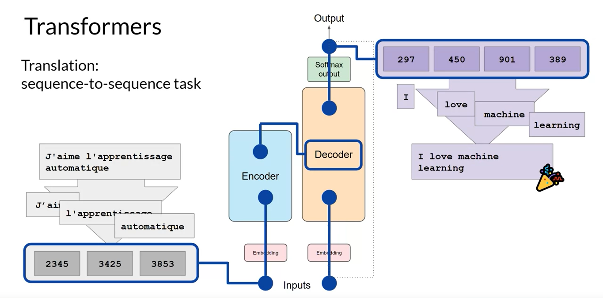

There are multiple ways in which you can use the output from the softmax layer to predict the next token. These can influence how creative your generated text is.

## Types of Models - Encoder Only, Encoder-Decoder and Decoder Only models

The complete transformer architecture consists of an encoder and decoder components.

The encoder encodes input sequences into a deep representation of the structure and meaning of the input. The decoder, working from input token triggers, uses the encoder's contextual understanding to generate new tokens.

It does this in a loop until some stop condition has been reached.

While the translation example you explored here used both the encoder and decoder parts of the transformer, you can split these components apart for variations of the architecture.

1. Encoder-only models also work as sequence-to-sequence models, but without further modification, the input sequence and the output sequence are of the same length. Their use is less common these days, but by adding additional layers to the architecture, you can train encoder-only models to perform classification tasks such as sentiment analysis, BERT is an example of an encoder-only model.

2. Encoder-decoder models, as you've seen, perform well on sequence-to-sequence tasks such as translation, where the input sequence and the output sequence can be different lengths. You can also scale and train this type of model to perform general text generation tasks. Examples of encoder-decoder models include BART as opposed to BERT and T5.

3. Finally, decoder-only models are some of the most commonly used today. Again, as they have scaled, their capabilities have grown. These models can now generalize to most tasks. Popular decoder-only models include the GPT family of models, BLOOM, Jurassic, LLaMA, and many more.

## In-context learning and types of in-context learning

The text that you feed into the model is called the prompt, the act of generating text is known as inference, and the output text is known as the completion. The full amount of text or the memory that is available to use for the prompt is called the context window.

Although the example here shows the model performing well, you'll frequently encounter situations where the model doesn't produce the outcome that you want on the first try.

You may have to revise the language in your prompt or the way that it's written several times to get the model to behave in the way that you want.

This work to develop and improve the prompt is known as prompt engineering. This is a big topic. But one powerful strategy to get the model to produce better outcomes is to include examples of the task that you want the model to carry out inside the prompt.

Providing examples inside the context window is called in-context learning.

Let's take a look at what this term means. With in-context learning, you can help LLMs learn more about the task being asked by including examples or additional data in the prompt.

Here is a concrete example. Within the prompt shown here, you ask the model to classify the sentiment of a review.

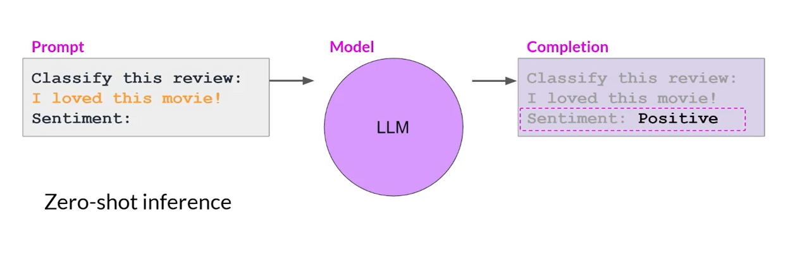

So whether the review of this movie is positive or negative, the prompt consists of the instruction, "Classify this review," followed by some context, which in this case is the review text itself, and an instruction to produce the sentiment at the end.

This method, including your input data within the prompt, is called `zero-shot inference`.

The largest of the LLMs are surprisingly good at this, grasping the task to be completed and returning a good answer.

In this example, the model correctly identifies the sentiment as positive.

Smaller models, on the other hand, can struggle with this.

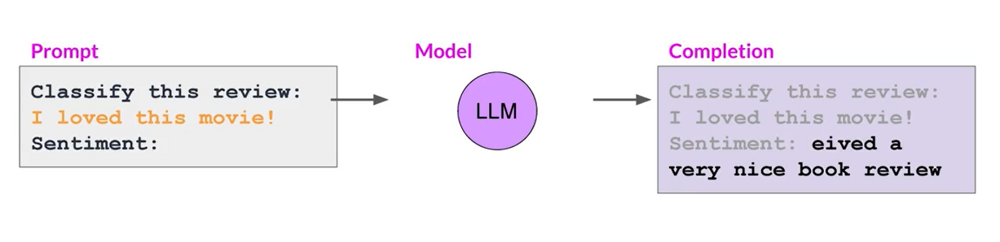

Here's an example of a completion generated by GPT-2, an earlier smaller version of the model that powers ChatGPT. As you can see, the model doesn't follow the instruction. While it does generate text with some relation to the prompt, the model can't figure out the details of the task and does not identify the sentiment.

This is where providing an example within the prompt can improve performance.

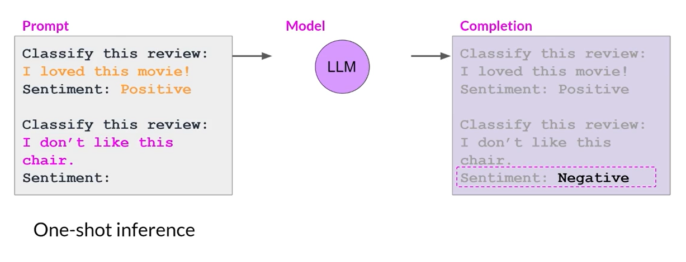

Here you can see that the prompt text is longer and now starts with a completed example that demonstrates the tasks to be carried out to the model.

After specifying that the model should classify the review, the prompt text includes a sample review. "I loved this movie", followed by a completed sentiment analysis. In this case, the review is positive.

Next, the prompt states the instruction again and includes the actual input review that we want the model to analyze.

You pass this new longer prompt to the smaller model, which now has a better chance of understanding the task you're specifying and the format of the response that you want.

The inclusion of a single example is known as one-shot inference, in contrast to the zero-shot prompt you supplied earlier.

Sometimes a single example won't be enough for the model to learn what you want it to do. So you can extend the idea of giving a single example to include multiple examples.

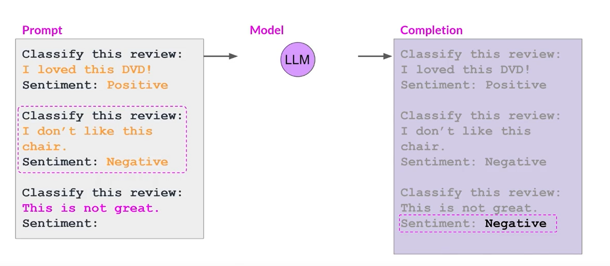

This is known as few-shot inference. Here, you're working with an even smaller model that failed to carry out good sentiment analysis with one-shot inference.

Instead, you're going to try few-shot inference by including a second example. This time, a negative review, including a mix of examples with different output classes can help the model to understand what it needs to do.

You pass the new prompts to the model. And this time it understands the instruction and generates a completion that correctly identifies the sentiment of the review as negative.

So to recap, you can engineer your prompts to encourage the model to learn by examples. While the largest models are good at zero-shot inference with no examples, smaller models can benefit from one-shot or few-shot inference that include examples of the desired behavior.

But remember the context window because you have a limit on the amount of in-context learning that you can pass into the model.

Generally, if you find that your model isn't performing well when, say, including five or six examples, you should try fine-tuning your model instead.

Fine-tuning performs additional training on the model using new data to make it more capable of the task you want it to perform.

## Parameters: `Max Token`, `Sample Top K`, `Sample Top P` & `Temperature`

In this part, you'll examine some of the methods and associated configuration parameters that you can use to influence the way that the model makes the final decision about next-word generation.

If you've used LLMs in playgrounds such as on the Hugging Face website or on AWS, you might have been presented with controls like these to adjust how the LLM behaves.

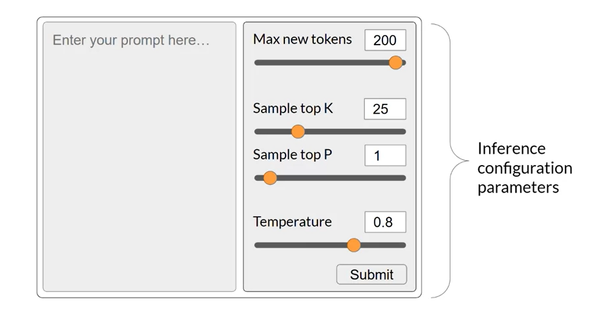

Each model exposes a set of configuration parameters that can influence the model's output during inference.

Note that these are different than the training parameters which are learned during training time.

Instead, these configuration parameters are invoked at inference time and give you control over things like the maximum number of tokens in the completion, and how creative the output is.

Max new tokens is probably the simplest of these parameters, and you can use it to limit the number of tokens that the model will generate.

You can think of this as putting a cap on the number of times the model will go through the selection process.

Here you can see examples of max new tokens being set to 100, 150, or 200.

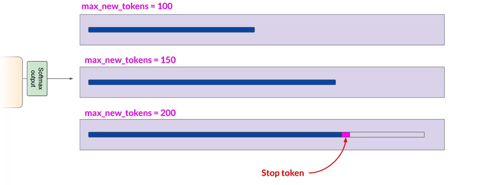

But note how the length of the completion in the example for 200 is shorter.

This is because another stop condition was reached, such as the model predicting and end of sequence token.

Remember it's max new tokens, not a hard number of new tokens generated.

The output from the transformer's softmax layer is a probability distribution across the entire dictionary of words that the model uses.

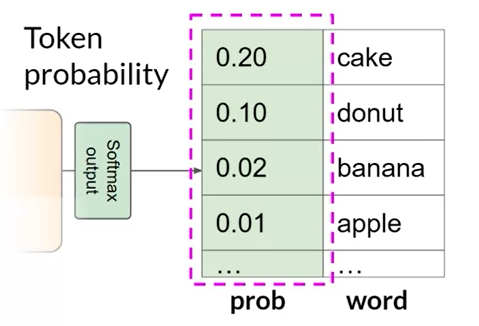

Here you can see a selection of words and their probability score next to them. Although we are only showing four words here, imagine that this is a list that carries on to the complete dictionary.

Most large language models by default will operate with so-called greedy decoding.

This is the simplest form of next-word prediction, where the model will always choose the word with the highest probability.

This method can work very well for short generation but is susceptible to repeated words or repeated sequences of words.

If you want to generate text that's more natural, more creative and avoids repeating words, you need to use some other controls.

Random sampling is the easiest way to introduce some variability.

Instead of selecting the most probable word every time with random sampling, the model chooses an output word at random using the probability distribution to weight the selection.

For example, in the illustration, the word banana has a probability score of 0.02.

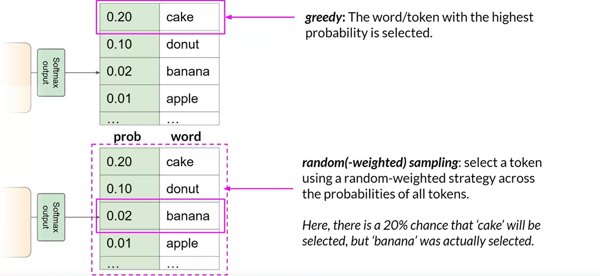

With random sampling, this equates to a 2% chance that this word will be selected. By using this sampling technique, we reduce the likelihood that words will be repeated.

However, depending on the setting, there is a possibility that the output may be too creative, producing words that cause the generation to wander off into topics or words that just don't make sense.

Note that in some implementations, you may need to disable greedy and enable random sampling explicitly.

For example, the Hugging Face transformers implementation that we use in the lab requires that we set do sample to equal true.

Let's explore top k and top p sampling techniques to help limit the random sampling and increase the chance that the output will be sensible.

Two Settings, top p and top k are sampling techniques that we can use to help limit the random sampling and increase the chance that the output will be sensible.

To limit the options while still allowing some variability, you can specify a top k value which instructs the model to choose from only the k tokens with the highest probability.

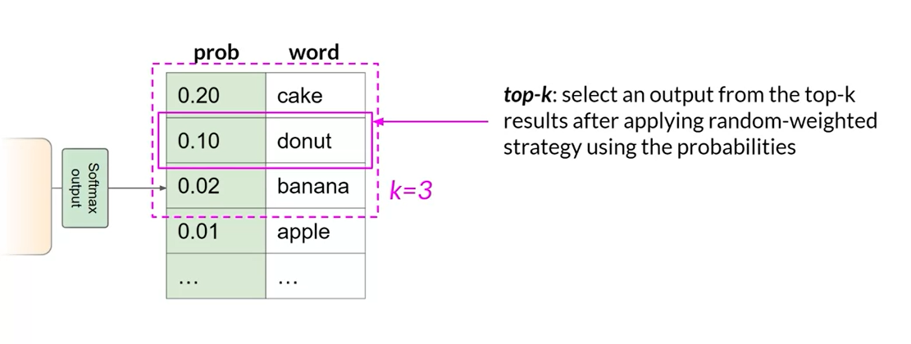

In this example here, k is set to three, so you're restricting the model to choose from these three options.

The model then selects from these options using the probability weighting and in this case, it chooses donut as the next word.

This method can help the model have some randomness while preventing the selection of highly improbable completion words.

This in turn makes your text generation more likely to sound reasonable and to make sense.

Alternatively, you can use the top p setting to limit the random sampling to the predictions whose combined probabilities do not exceed p.

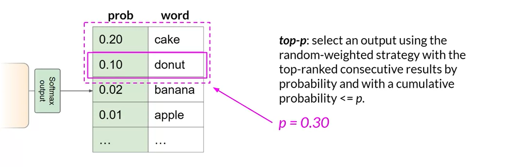

For example, if you set p to equal 0.3, the options are cake and donut since their probabilities of 0.2 and 0.1 add up to 0.3.

The model then uses the random probability weighting method to choose from these tokens.

With top k, you specify the number of tokens to randomly choose from, and with top p, you specify the total probability that you want the model to choose from.

One more parameter that you can use to control the randomness of the model output is known as temperature.

This parameter influences the shape of the probability distribution that the model calculates for the next token.

Broadly speaking, the higher the temperature, the higher the randomness, and the lower the temperature, the lower the randomness.

The temperature value is a scaling factor that's applied within the final softmax layer of the model that impacts the shape of the probability distribution of the next token.

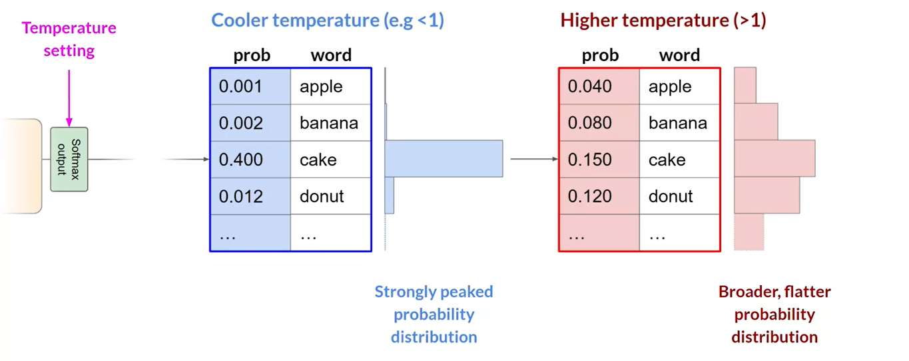

In contrast to the top k and top p parameters, changing the temperature actually alters the predictions that the model will make.

If you choose a low value of temperature, say less than one, the resulting probability distribution from the softmax layer is more strongly peaked with the probability being concentrated in a smaller number of words.

You can see this here in the blue bars beside the table, which show a probability bar chart turned on its side. Most of the probability here is concentrated on the word cake.

The model will select from this distribution using random sampling and the resulting text will be less random and will more closely follow the most likely word sequences that the model learned during training.

If instead you set the temperature to a higher value, say, greater than one, then the model will calculate a broader flatter probability distribution for the next token.

Notice that in contrast to the blue bars, the probability is more evenly spread across the tokens.

This leads the model to generate text with a higher degree of randomness and more variability in the output compared to a cool temperature setting. This can help you generate text that sounds more creative.

If you leave the temperature value equal to one, this will leave the softmax function as default and the unaltered probability distribution will be used.

## Generative AI life cycle

In this section, you'll walk through a generative AI project life cycle that can help guide you through this work.

This framework maps out the tasks required to take your project from conception to launch.

Here is a diagram of the overall life cycle.

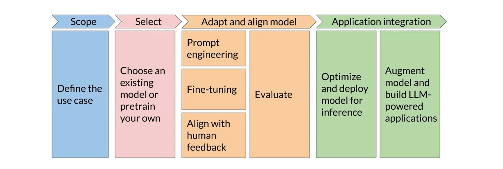

The most important step in any project is to define the scope as accurately and narrowly as you can.

LLMs are capable of carrying out many tasks, but their abilities depend strongly on the size and architecture of the model.

You should think about what function the LLM will have in your specific application. Do you need the model to be able to carry out many different tasks, including long-form text generation or with a high degree of capability, or is the task much more specific like named entity recognition so that your model only needs to be good at one thing.

Getting really specific about what you need your model to do can save you time and perhaps more importantly, compute cost.

Once you're happy, and you've scoped your model requirements enough to begin development. Your first decision will be whether to train your own model from scratch or work with an existing base model.

In general, you'll start with an existing model, although there are some cases where you may find it necessary to train a model from scratch.

With your model in hand, the next step is to assess its performance and carry out additional training if needed for your application.

Prompt engineering can sometimes be enough to get your model to perform well, so you'll likely start by trying in-context learning, using examples suited to your task and use case.

There are still cases, however, where the model may not perform as well as you need, even with one or a few shot inference, and in that case, you can try fine-tuning your model.

As models become more capable, it's becoming increasingly important to ensure that they behave well and in a way that is aligned with human preferences in deployment. An additional fine-tuning technique called reinforcement learning with human feedback, which can help to make sure that your model behaves well.

An important aspect of all of these techniques is evaluation.

Note that this adapt and aligned stage of app development can be highly iterative. You may start by trying prompt engineering and evaluating the outputs, then using fine tuning to improve performance and then revisiting and evaluating prompt engineering one more time to get the performance that you need.

Finally, when you've got a model that is meeting your performance needs and is well aligned, you can deploy it into your infrastructure and integrate it with your application.

At this stage, an important step is to optimize your model for deployment. This can ensure that you're making the best use of your compute resources and providing the best possible experience for the users of your application.

The last but very important step is to consider any additional infrastructure that your application will require to work well.

There are some fundamental limitations of LLMs that can be difficult to overcome through training alone like their tendency to invent information when they don't know an answer, or their limited ability to carry out complex reasoning and mathematics.
