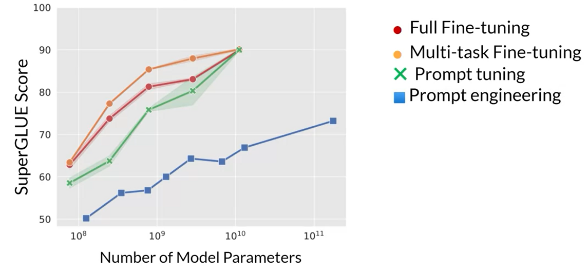

# Generative AI and Large Language Models

## Introduction

Large language models or LLMs are a very exciting technology. But despite all the buzz and hype, one of the thing that is still underestimated by many people is their power as a developer tool.

Specifically, there are many machine learning and AI applications that used to take many months to build that you can now build in days or maybe even small numbers of weeks. This note will take a deep dive with you into how LLM technology actually works including going through many of the technical details, like model training, instruction tuning, fine-tuning, the generative AI project life cycle framework to help you plan and execute your projects and so on.

Generative AI and LLMs specifically are a general purpose technology. That means that similar to other general purpose technologies like deep learning and electricity, is useful not just for a single application, but for a lot of different applications that span many corners of the economy.

The first section will share with you a deep dive into how transformer networks actually work. In 2017, the paper came out, Attention is all You Need, and it laid out all of these fairly complex data processes which are going to happen inside the transformer architecture. So we take a little bit of a high level view, but we do go down into some depths. We talk about things like self-attention and the multi-headed self-attention mechanism. So we can see why it is that these models actually work, how it is that they actually gain an understanding of language.

It's been really interesting to see how that basic transformer architecture is creating a foundation for vision transformers as well. Understanding transformers is also helping people understand this really exciting vision transformer and other modalities as well. It's going to be a really critical building block for a lot of machine learning.

Then comes the Generative AI project Lifecycle which walks you through the individual stages and decisions you have to make when you're developing Generative AI applications. So one of the first things you have to decide is whether you're taking a foundation model off the shelf or you're actually pre-training your own model and then as a follow up, whether you want to fine tune and customize that model maybe for your specific data.

There might be use cases where you really need the model to be very comprehensive and able to generalize to a lot of different tasks. And there might be use cases where you're just optimizing for a single-use case, right? And you can potentially work with a smaller model and achieving similar or even very good results. When you want your large language model to have a lot of general knowledge about the world, when you wanted to know stuff about history and philosophy and the sizes and how to write Python code and so on and so on. It helps to have a giant model with hundreds of billions of parameters. But for a single task like summarizing dialogue or acting as a customer service agent for one company, for applications like that, sometimes you can use hundreds of billions of parameters models. But that's not always necessary.

We'll talk about large language models, their use cases, how the models work, prompt engineering, how to make creative text outputs, and outline a project lifecycle for generative AI projects.

## Foundation models

Whether it be a chat bot, generating images from text, or using a plugin to help you develop code, what you see in these tools is a machine that is capable of creating content that mimics or approximates human ability.

Generative AI is a subset of traditional machine learning. And the machine learning models that underpin generative AI have learned these abilities by finding statistical patterns in massive datasets of content that was originally generated by humans. Large language models have been trained on trillions of words over many weeks and months, and with large amounts of compute power. These foundation models, as we call them, with billions of parameters, exhibit emergent properties beyond language alone, and researchers are unlocking their ability to break down complex tasks, reason, and problem solve.


Here are a collection of foundation models, sometimes called base models, and their relative size in terms of their parameters. You can think of them as the model's memory. And the more parameters a model has, the more memory, and as it turns out, the more sophisticated the tasks it can perform.

By either using these models as they are or by applying fine tuning techniques to adapt them to your specific use case, you can rapidly build customized solutions without the need to train a new model from scratch.

Now, while generative AI models are being created for multiple modalities, including images, video, audio, and speech, you'll focus on large language models and their uses in natural language generation. You will see how they are built and trained, how you can interact with them via text known as prompts. And how to fine tune models for your use case and data, and how you can deploy them with applications to solve your business and social tasks.

The way you interact with language models is quite different than other machine learning and programming paradigms. In those cases, you write computer code with formalized syntax to interact with libraries and APIs.

In contrast, large language models are able to take natural language or human written instructions and perform tasks much as a human would. The text that you pass to an LLM is known as a `prompt`. The space or memory that is available to the prompt is called the `context window`, and this is typically large enough for a few thousand words, but differs from model to model.

In this example, you ask the model to determine `where Ganymede is located in the solar system?`. The prompt is passed to the model, the model then predicts the next words, and because your prompt contained a question, this model generates an answer. The output of the model is called a `completion`, and the act of using the model to generate text is known as `inference`. The completion is comprised of the text contained in the original prompt, followed by the generated text.


## Use cases of LLMs

LLMs and generative AI are focused on chats tasks. After all, chatbots are highly visible and getting a lot of attention. Next word prediction is the base concept behind a number of different capabilities, starting with a basic chatbot.

However, you can use this conceptually simple technique for a variety of other tasks within text generation.

For example, you can ask a model to write an essay based on a prompt, to summarize conversations where you provide the dialogue as part of your prompt and the model uses this data along with its understanding of natural language to generate a summary.

You can use models for a variety of translation tasks from traditional translation between two different languages, such as French and German, or English and Spanish.

Or to translate natural language to machine code. For example, you could ask a model to "write some Python code that will return the mean of every column in a DataFrame" and the model will generate code that you can pass to an interpreter.

You can use LLMs to carry out smaller, focused tasks like information retrieval. In this example, you ask the model to identify all of the people and places identified in a news article. This is known as `named entity recognition`, a word classification. The understanding of knowledge encoded in the model's parameters allows it to correctly carry out this task and return the requested information to you.

Finally, an area of active development is augmenting LLMs by connecting them to external data sources or using them to invoke external APIs. You can use this ability to provide the model with information it doesn't know from its pre-training and to enable your model to power interactions with the real-world.

Developers have discovered that as the scale of foundation models grows from hundreds of millions of parameters to billions, even hundreds of billions, the subjective understanding of language that a model possesses also increases.

This language understanding stored within the parameters of the model is what processes, reasons, and ultimately solves the tasks you give it, but it's also true that smaller models can be fine tuned to perform well on specific focused tasks.

## Text Generation before transformers

It's important to note that generative algorithms are not new. Previous generations of language models made use of an architecture called recurrent neural networks or RNNs.

RNNs while powerful for their time, were limited by the amount of compute and memory needed to perform well at generative tasks. Let's look at an example of an RNN carrying out a simple next-word prediction generative task.

```
...tastes ?
...tea tastes ?
..., my tea tastes (great) - Prediction
[The milk was bad], so the tea tastes (great) X
```

With just one previous words seen by the model, the prediction can't be very good. As you scale the RNN implementation to be able to see more of the preceding words in the text, you have to significantly scale the resources that the model uses. As for the prediction, well, the model failed here.

Even though you scale the model, it still hasn't seen enough of the input to make a good prediction. To successfully predict the next word, models need to see more than just the previous few words. Models needs to have an understanding of the whole sentence or even the whole document.

The problem here is that language is complex. In many languages, one word can have multiple meanings. These are homonyms.

```
I took my money to (bank).
```

In this case, it's only with the context of the sentence that we can see what kind of bank is meant.

Words within a sentence structures can be ambiguous or have what we might call syntactic ambiguity. Take for example this sentence,

```
The teacher taught the students with the book.
```

Did the teacher teach using the book or did the student have the book, or was it both? How can an algorithm make sense of human language if sometimes we can't?

In 2017, after the publication of this paper, `Attention is All You Need`, from Google and the University of Toronto, everything changed. The transformer architecture had arrived. This novel approach unlocked the progress in generative AI that we see today.

It can be scaled efficiently to use multi-core GPUs, it can parallel process input data, making use of much larger training datasets, and crucially, it's able to learn to pay attention to the meaning of the words it's processing. And attention is all you need.

## Transformers

Building large language models using the transformer architecture dramatically improved the performance of natural language tasks over the earlier generation of RNNs, and led to an explosion in regenerative capability.

The power of the transformer architecture lies in its ability to learn the relevance and context of all of the words in a sentence. Not just as you see here, to each word next to its neighbor, but to every other word in a sentence.


To apply attention weights to those relationships so that the model learns the relevance of each word to each other words no matter where they are in the input. This gives the algorithm the ability to learn who has the book, who could have the book, and if it's even relevant to the wider context of the document.

These attention weights are learned during LLM training and you'll learn more about this later this week. This diagram is called an attention map and can be useful to illustrate the attention weights between each word and every other word. Here in this stylized example, you can see that the word book is strongly connected with or paying attention to the word teacher and the word student. This is called self-attention and the ability to learn attension in this way across the whole input significantly approves the model's ability to encode language.


Now that you've seen one of the key attributes of the transformer architecture, self-attention, let's cover at a high level how the model works.


Here's a simplified diagram of the transformer architecture so that you can focus at a high level on where these processes are taking place.

The transformer architecture is split into two distinct parts, the encoder and the decoder.

These components work in conjunction with each other and they share a number of similarities.

Also, note here, the diagram you see is derived from the original attention is all you need paper. Notice how the inputs to the model are at the bottom and the outputs are at the top.

Now, machine-learning models are just big statistical calculators and they work with numbers, not words. So before passing texts into the model to process, you must first tokenize the words.

Simply put, this converts the words into numbers, with each number representing a position in a dictionary of all the possible words that the model can work with.

You can choose from multiple tokenization methods. For example, token IDs matching to complete words, or using token IDs to represent parts of words. What's important is that once you've selected a tokenizer to train the model, you must use the same tokenizer when you generate text.

Now that your input is represented as numbers, you can pass it to the embedding layer.

This layer is a trainable vector embedding space, a high-dimensional space where each token is represented as a vector and occupies a unique location within that space.

Each token ID in the vocabulary is matched to a multi-dimensional vector, and the intuition is that these vectors learn to encode the meaning and context of individual tokens in the input sequence.

Embedding vector spaces have been used in natural language processing for some time, previous generation language algorithms like Word2vec use this concept.

Looking back at the sample sequence, you can see that in this simple case, each word has been matched to a token ID, and each token is mapped into a vector.


In the original transformer paper, the vector size was actually 512, so much bigger than we can fit onto this image. For simplicity, if you imagine a vector size of just three, you could plot the words into a three-dimensional space and see the relationships between those words.


You can see now how you can relate words that are located close to each other in the embedding space, and how you can calculate the distance between the words as an angle, which gives the model the ability to mathematically understand language.

As you add the token vectors into the base of the encoder or the decoder, you also add positional encoding. The model processes each of the input tokens in parallel. So by adding the positional encoding, you preserve the information about the word order and don't lose the relevance of the position of the word in the sentence.


Once you've summed the input tokens and the positional encodings, you pass the resulting vectors to the self-attention layer. Here, the model analyzes the relationships between the tokens in your input sequence.

As you saw earlier, this allows the model to attend to different parts of the input sequence to better capture the contextual dependencies between the words.

The self-attention weights that are learned during training and stored in these layers reflect the importance of each word in that input sequence to all other words in the sequence.

But this does not happen just once, the transformer architecture actually has multi-headed self-attention. This means that multiple sets of self-attention weights or heads are learned in parallel independently of each other.

The number of attention heads included in the attention layer varies from model to model, but numbers in the range of 12-100 are common.

The intuition here is that each self-attention head will learn a different aspect of language. For example, one head may see the relationship between the people entities in our sentence. Whilst another head may focus on the activity of the sentence. Whilst yet another head may focus on some other properties such as if the words rhyme.

It's important to note that you don't dictate ahead of time what aspects of language the attention heads will learn. The weights of each head are randomly initialized and given sufficient training data and time, each will learn different aspects of language.


While some attention maps are easy to interpret, like the examples discussed here, others may not be.

Now that all of the attention weights have been applied to your input data, the output is processed through a fully-connected feed-forward network.

The output of this layer is a vector of logits proportional to the probability score for each and every token in the tokenizer dictionary.


You can then pass these logits to a final softmax layer, where they are normalized into a probability score for each word.

This output includes a probability for every single word in the vocabulary, so there's likely to be thousands of scores here. One single token will have a score higher than the rest. This is the most likely predicted token.


[Transformer paper](https://arxiv.org/pdf/1706.03762)

## Example of transfomer working on text

At this point, you've seen a high-level overview of some of the major components inside the transformer architecture. But you still haven't seen how the overall prediction process works from end to end.

Let's walk through a simple example. In this example, you'll look at a translation task or a sequence-to-sequence task, which incidentally was the original objective of the transformer architecture designers.

You'll use a transformer model to translate the French phrase into English.

First, you'll tokenize the input words using this same tokenizer that was used to train the network.

These tokens are then added into the input on the encoder side of the network, passed through the embedding layer, and then fed into the multi-headed attention layers.

The outputs of the multi-headed attention layers are fed through a feed-forward network to the output of the encoder.

At this point, the data that leaves the encoder is a deep representation of the structure and meaning of the input sequence.

This representation is inserted into the middle of the decoder to influence the decoder's self-attention mechanisms.

Next, a start of sequence token is added to the input of the decoder.

This triggers the decoder to predict the next token, which it does based on the contextual understanding that it's being provided from the encoder.

The output of the decoder's self-attention layers gets passed through the decoder feed-forward network and through a final softmax output layer.

At this point, we have our first token.

You'll continue this loop, passing the output token back to the input to trigger the generation of the next token, until the model predicts an end-of-sequence token.

At this point, the final sequence of tokens can be detokenized into words, and you have your output. In this case, I love machine learning.


There are multiple ways in which you can use the output from the softmax layer to predict the next token. These can influence how creative your generated text is.

## Types of Models - Encoder Only, Encoder-Decoder and Decoder Only models

The complete transformer architecture consists of an encoder and decoder components.

The encoder encodes input sequences into a deep representation of the structure and meaning of the input. The decoder, working from input token triggers, uses the encoder's contextual understanding to generate new tokens.

It does this in a loop until some stop condition has been reached.

While the translation example you explored here used both the encoder and decoder parts of the transformer, you can split these components apart for variations of the architecture.

1. Encoder-only models also work as sequence-to-sequence models, but without further modification, the input sequence and the output sequence are of the same length. Their use is less common these days, but by adding additional layers to the architecture, you can train encoder-only models to perform classification tasks such as sentiment analysis, BERT is an example of an encoder-only model.

2. Encoder-decoder models, as you've seen, perform well on sequence-to-sequence tasks such as translation, where the input sequence and the output sequence can be different lengths. You can also scale and train this type of model to perform general text generation tasks. Examples of encoder-decoder models include BART as opposed to BERT and T5.

3. Finally, decoder-only models are some of the most commonly used today. Again, as they have scaled, their capabilities have grown. These models can now generalize to most tasks. Popular decoder-only models include the GPT family of models, BLOOM, Jurassic, LLaMA, and many more.

[BLOOM paper](https://arxiv.org/abs/2211.05100)

[LLaMA: Open and Efficient Foundation Language Models](https://arxiv.org/pdf/2302.13971)

## In-context learning and types of in-context learning

The text that you feed into the model is called the prompt, the act of generating text is known as inference, and the output text is known as the completion. The full amount of text or the memory that is available to use for the prompt is called the context window.

Although the example here shows the model performing well, you'll frequently encounter situations where the model doesn't produce the outcome that you want on the first try.

You may have to revise the language in your prompt or the way that it's written several times to get the model to behave in the way that you want.

This work to develop and improve the prompt is known as prompt engineering. This is a big topic. But one powerful strategy to get the model to produce better outcomes is to include examples of the task that you want the model to carry out inside the prompt.

Providing examples inside the context window is called in-context learning.

Let's take a look at what this term means. With in-context learning, you can help LLMs learn more about the task being asked by including examples or additional data in the prompt.

Here is a concrete example. Within the prompt shown here, you ask the model to classify the sentiment of a review.


So whether the review of this movie is positive or negative, the prompt consists of the instruction, "Classify this review," followed by some context, which in this case is the review text itself, and an instruction to produce the sentiment at the end.

This method, including your input data within the prompt, is called `zero-shot inference`.

The largest of the LLMs are surprisingly good at this, grasping the task to be completed and returning a good answer.

In this example, the model correctly identifies the sentiment as positive.

Smaller models, on the other hand, can struggle with this.


Here's an example of a completion generated by GPT-2, an earlier smaller version of the model that powers ChatGPT. As you can see, the model doesn't follow the instruction. While it does generate text with some relation to the prompt, the model can't figure out the details of the task and does not identify the sentiment.

This is where providing an example within the prompt can improve performance.


Here you can see that the prompt text is longer and now starts with a completed example that demonstrates the tasks to be carried out to the model.

After specifying that the model should classify the review, the prompt text includes a sample review. "I loved this movie", followed by a completed sentiment analysis. In this case, the review is positive.

Next, the prompt states the instruction again and includes the actual input review that we want the model to analyze.

You pass this new longer prompt to the smaller model, which now has a better chance of understanding the task you're specifying and the format of the response that you want.

The inclusion of a single example is known as one-shot inference, in contrast to the zero-shot prompt you supplied earlier.

Sometimes a single example won't be enough for the model to learn what you want it to do. So you can extend the idea of giving a single example to include multiple examples.


This is known as few-shot inference. Here, you're working with an even smaller model that failed to carry out good sentiment analysis with one-shot inference.

Instead, you're going to try few-shot inference by including a second example. This time, a negative review, including a mix of examples with different output classes can help the model to understand what it needs to do.

You pass the new prompts to the model. And this time it understands the instruction and generates a completion that correctly identifies the sentiment of the review as negative.

So to recap, you can engineer your prompts to encourage the model to learn by examples. While the largest models are good at zero-shot inference with no examples, smaller models can benefit from one-shot or few-shot inference that include examples of the desired behavior.

But remember the context window because you have a limit on the amount of in-context learning that you can pass into the model.

Generally, if you find that your model isn't performing well when, say, including five or six examples, you should try fine-tuning your model instead.

Fine-tuning performs additional training on the model using new data to make it more capable of the task you want it to perform.

## Parameters: `Max Token`, `Sample Top K`, `Sample Top P` & `Temperature`

In this part, you'll examine some of the methods and associated configuration parameters that you can use to influence the way that the model makes the final decision about next-word generation.

If you've used LLMs in playgrounds such as on the Hugging Face website or on AWS, you might have been presented with controls like these to adjust how the LLM behaves.


Each model exposes a set of configuration parameters that can influence the model's output during inference.

Note that these are different than the training parameters which are learned during training time.

Instead, these configuration parameters are invoked at inference time and give you control over things like the maximum number of tokens in the completion, and how creative the output is.

Max new tokens is probably the simplest of these parameters, and you can use it to limit the number of tokens that the model will generate.

You can think of this as putting a cap on the number of times the model will go through the selection process.

Here you can see examples of max new tokens being set to 100, 150, or 200.


But note how the length of the completion in the example for 200 is shorter.

This is because another stop condition was reached, such as the model predicting and end of sequence token.

Remember it's max new tokens, not a hard number of new tokens generated.

The output from the transformer's softmax layer is a probability distribution across the entire dictionary of words that the model uses.


Here you can see a selection of words and their probability score next to them. Although we are only showing four words here, imagine that this is a list that carries on to the complete dictionary.

Most large language models by default will operate with so-called greedy decoding.

This is the simplest form of next-word prediction, where the model will always choose the word with the highest probability.

This method can work very well for short generation but is susceptible to repeated words or repeated sequences of words.

If you want to generate text that's more natural, more creative and avoids repeating words, you need to use some other controls.

Random sampling is the easiest way to introduce some variability.

Instead of selecting the most probable word every time with random sampling, the model chooses an output word at random using the probability distribution to weight the selection.

For example, in the illustration, the word banana has a probability score of 0.02.


With random sampling, this equates to a 2% chance that this word will be selected. By using this sampling technique, we reduce the likelihood that words will be repeated.

However, depending on the setting, there is a possibility that the output may be too creative, producing words that cause the generation to wander off into topics or words that just don't make sense.

Note that in some implementations, you may need to disable greedy and enable random sampling explicitly.

For example, the Hugging Face transformers implementation that we use in the lab requires that we set do sample to equal true.

Let's explore top k and top p sampling techniques to help limit the random sampling and increase the chance that the output will be sensible.

Two Settings, top p and top k are sampling techniques that we can use to help limit the random sampling and increase the chance that the output will be sensible.

To limit the options while still allowing some variability, you can specify a top k value which instructs the model to choose from only the k tokens with the highest probability.


In this example here, k is set to three, so you're restricting the model to choose from these three options.

The model then selects from these options using the probability weighting and in this case, it chooses donut as the next word.

This method can help the model have some randomness while preventing the selection of highly improbable completion words.

This in turn makes your text generation more likely to sound reasonable and to make sense.

Alternatively, you can use the top p setting to limit the random sampling to the predictions whose combined probabilities do not exceed p.


For example, if you set p to equal 0.3, the options are cake and donut since their probabilities of 0.2 and 0.1 add up to 0.3.

The model then uses the random probability weighting method to choose from these tokens.

With top k, you specify the number of tokens to randomly choose from, and with top p, you specify the total probability that you want the model to choose from.

One more parameter that you can use to control the randomness of the model output is known as temperature.

This parameter influences the shape of the probability distribution that the model calculates for the next token.

Broadly speaking, the higher the temperature, the higher the randomness, and the lower the temperature, the lower the randomness.

The temperature value is a scaling factor that's applied within the final softmax layer of the model that impacts the shape of the probability distribution of the next token.


In contrast to the top k and top p parameters, changing the temperature actually alters the predictions that the model will make.

If you choose a low value of temperature, say less than one, the resulting probability distribution from the softmax layer is more strongly peaked with the probability being concentrated in a smaller number of words.

You can see this here in the blue bars beside the table, which show a probability bar chart turned on its side. Most of the probability here is concentrated on the word cake.

The model will select from this distribution using random sampling and the resulting text will be less random and will more closely follow the most likely word sequences that the model learned during training.

If instead you set the temperature to a higher value, say, greater than one, then the model will calculate a broader flatter probability distribution for the next token.

Notice that in contrast to the blue bars, the probability is more evenly spread across the tokens.

This leads the model to generate text with a higher degree of randomness and more variability in the output compared to a cool temperature setting. This can help you generate text that sounds more creative.

If you leave the temperature value equal to one, this will leave the softmax function as default and the unaltered probability distribution will be used.

[Hugging face models](https://huggingface.co/models)

[Hugging face tasks](https://huggingface.co/tasks)

## Generative AI life cycle

In this section, you'll walk through a generative AI project life cycle that can help guide you through this work.

This framework maps out the tasks required to take your project from conception to launch.

Here is a diagram of the overall life cycle.


The most important step in any project is to define the scope as accurately and narrowly as you can.

LLMs are capable of carrying out many tasks, but their abilities depend strongly on the size and architecture of the model.

You should think about what function the LLM will have in your specific application. Do you need the model to be able to carry out many different tasks, including long-form text generation or with a high degree of capability, or is the task much more specific like named entity recognition so that your model only needs to be good at one thing.

Getting really specific about what you need your model to do can save you time and perhaps more importantly, compute cost.

Once you're happy, and you've scoped your model requirements enough to begin development. Your first decision will be whether to train your own model from scratch or work with an existing base model.

In general, you'll start with an existing model, although there are some cases where you may find it necessary to train a model from scratch.

With your model in hand, the next step is to assess its performance and carry out additional training if needed for your application.

Prompt engineering can sometimes be enough to get your model to perform well, so you'll likely start by trying in-context learning, using examples suited to your task and use case.

There are still cases, however, where the model may not perform as well as you need, even with one or a few shot inference, and in that case, you can try fine-tuning your model.

As models become more capable, it's becoming increasingly important to ensure that they behave well and in a way that is aligned with human preferences in deployment. An additional fine-tuning technique called reinforcement learning with human feedback, which can help to make sure that your model behaves well.

An important aspect of all of these techniques is evaluation.

Note that this adapt and aligned stage of app development can be highly iterative. You may start by trying prompt engineering and evaluating the outputs, then using fine tuning to improve performance and then revisiting and evaluating prompt engineering one more time to get the performance that you need.

Finally, when you've got a model that is meeting your performance needs and is well aligned, you can deploy it into your infrastructure and integrate it with your application.

At this stage, an important step is to optimize your model for deployment. This can ensure that you're making the best use of your compute resources and providing the best possible experience for the users of your application.

The last but very important step is to consider any additional infrastructure that your application will require to work well.

There are some fundamental limitations of LLMs that can be difficult to overcome through training alone like their tendency to invent information when they don't know an answer, or their limited ability to carry out complex reasoning and mathematics.

## Pre-Training large language models

Once you have scoped out your use case, and determined how you'll need the LLM to work within your application, your next step is to select a model to work with.

Your first choice will be to either work with an existing model, or train your own from scratch.

There are specific circumstances where training your own model from scratch might be advantageous.

In general, however, you'll begin the process of developing your application using an existing foundation model.

Many open-source models are available for members of the AI community like you to use in your application. The developers of some of the major frameworks for building generative AI applications like Hugging Face and PyTorch, have curated hubs where you can browse these models.

A really useful feature of these hubs is the inclusion of model cards, that describe important details including the best use cases for each model, how it was trained, and known limitations.

The exact model that you'd choose will depend on the details of the task you need to carry out.

Variance of the transformer model architecture are suited to different language tasks, largely because of differences in how the models are trained.

Let's take a closer look at how large language models are trained. With this knowledge in hand, you'll find it easier to navigate the model hubs and find the best model for your use case.

To begin, let's take a high-level look at the initial training process for LLMs. This phase is often referred to as pre-training.

LLMs encode a deep statistical representation of language. This understanding is developed during the models pre-training phase when the model learns from vast amounts of unstructured textual data.

This can be gigabytes, terabytes, and even petabytes of text. This data is pulled from many sources, including scrapes off the Internet and corpora of texts that have been assembled specifically for training language models.

In this self-supervised learning step, the model internalizes the patterns and structures present in the language. These patterns then enable the model to complete its training objective, which depends on the architecture of the model.

During pre-training, the model weights get updated to minimize the loss of the training objective. The encoder generates an embedding or vector representation for each token.

Pre-training also requires a large amount of compute and the use of GPUs.

Note, when you scrape training data from public sites such as the Internet, you often need to process the data to increase quality, address bias, and remove other harmful content.

As a result of this data quality curation, often only 1-3% of tokens are used for pre-training. You should consider this when you estimate how much data you need to collect if you decide to pre-train your own model.

There were three variance of the transformer model; encoder-only encoder-decoder models, and decode-only.

Each of these is trained on a different objective, and so learns how to carry out different tasks.

Encoder-only models are also known as Autoencoding models, and they are pre-trained using masked language modeling. Here, tokens in the input sequence are randomly mask, and the training objective is to predict the mask tokens in order to reconstruct the original sentence.

This is also called a denoising objective. Autoencoding models spilled bi-directional representations of the input sequence, meaning that the model has an understanding of the full context of a token and not just of the words that come before.

Encoder-only models are ideally suited to task that benefit from this bi-directional contexts. You can use them to carry out sentence classification tasks, for example, sentiment analysis or token-level tasks like named entity recognition or word classification.

Some well-known examples of an autoencoder model are BERT and RoBERTa.

Now, let's take a look at decoder-only or autoregressive models, which are pre-trained using causal language modeling. Here, the training objective is to predict the next token based on the previous sequence of tokens.

Predicting the next token is sometimes called full language modeling by researchers.

Decoder-based autoregressive models, mask the input sequence and can only see the input tokens leading up to the token in question. The model has no knowledge of the end of the sentence.

The model then iterates over the input sequence one by one to predict the following token. In contrast to the encoder architecture, this means that the context is unidirectional.

By learning to predict the next token from a vast number of examples, the model builds up a statistical representation of language.

Models of this type make use of the decoder component of the original transformer architecture without the encoder.

Decoder-only models are often used for text generation, although larger decoder-only models show strong zero-shot inference abilities, and can often perform a range of tasks well.

Well known examples of decoder-based autoregressive models are GPT and BLOOM.

The final variation of the transformer model is the sequence-to-sequence model that uses both the encoder and decoder parts off the original transformer architecture.

The exact details of the pre-training objective vary from model to model. A popular sequence-to-sequence model T5, pre-trains the encoder using span corruption, which masks random sequences of input tokens.

Those mass sequences are then replaced with a unique Sentinel token, shown here as x. Sentinel tokens are special tokens added to the vocabulary, but do not correspond to any actual word from the input text.

The decoder is then tasked with reconstructing the mask token sequences auto-regressively. The output is the Sentinel token followed by the predicted tokens.

You can use sequence-to-sequence models for translation, summarization, and question-answering. They are generally useful in cases where you have a body of texts as both input and output.

Besides T5, another well-known encoder-decoder model is BART, not BERT.

[What Language Model Architecture and Pretraining Objective Work Best for Zero-Shot Generalization?](https://arxiv.org/pdf/2204.05832)

[Language models are few-shot learners](https://arxiv.org/pdf/2005.14165)

## Computational challenge in training large language models

One of the most common issues you still counter when you try to train large language models is running out of memory.

CUDA, short for Compute Unified Device Architecture, is a collection of libraries and tools developed for Nvidia GPUs. Libraries such as PyTorch and TensorFlow use CUDA to boost performance on metrics multiplication and other operations common to deep learning.

You'll encounter these out-of-memory issues because most LLMs are huge, and require a ton of memory to store and train all of their parameters.

Let's do some quick math to develop intuition about the scale of the problem.

A single parameter is typically represented by a 32-bit float, which is a way computers represent real numbers. You'll see more details about how numbers gets stored in this format shortly.

A 32-bit float takes up four bytes of memory. So to store one billion parameters you'll need four bytes times one billion parameters, or four gigabyte of GPU RAM at 32-bit full precision.

This is a lot of memory, and note, if only accounted for the memory to store the model weights so far. If you want to train the model, you'll have to plan for additional components that use GPU memory during training.

These include two Adam optimizer states, gradients, activations, and temporary variables needed by your functions.

This can easily lead to 20 extra bytes of memory per model parameter. In fact, to account for all of these overhead during training, you'll actually require approximately 6 times the amount of GPU RAM that the model weights alone take up.

To train a one billion parameter model at 32-bit full precision, you'll need approximately 24 gigabyte of GPU RAM. This is definitely too large for consumer hardware, and even challenging for hardware used in data centers, if you want to train with a single processor.

What options do you have to reduce the memory required for training? One technique that you can use to reduce the memory is called quantization.

The main idea here is that you reduce the memory required to store the weights of your model by reducing their precision from 32-bit floating point numbers to 16-bit floating point numbers, or eight-bit integer numbers.

The corresponding data types used in deep learning frameworks and libraries are FP32 for 32-bit full position, FP16, or BFLOAT16 for 16-bit half precision, and INT8 eight-bit integers.

The range of numbers you can represent with FP32 goes from approximately $-3*10^38$ to $3*10^38$. By default, model weights, activations, and other model parameters are stored in FP32.

Quantization statistically projects the original 32-bit floating point numbers into a lower precision space, using scaling factors calculated based on the range of the original 32-bit floating point numbers.

Let's look at an example. Suppose you want to store a PI to six decimal places in different positions. Floating point numbers are stored as a series of bits zeros and ones.

The 32 bits to store numbers in full precision with FP32 consist of one bit for the sign where zero indicates a positive number, and one a negative number. Then eight bits for the exponent of the number, and 23 bits representing the fraction of the number. The fraction is also referred to as the mantissa, or significant. It represents the precision bits off the number. If you convert the 32-bit floating point value back to a decimal value, you notice the slight loss in precision.

Now, let's see what happens if you project this FP32 representation of Pi into the FP16, 16-bit lower precision space. The 16 bits consists of one bit for the sign, as you saw for FP32, but now FP16 only assigns five bits to represent the exponent and 10 bits to represent the fraction. Therefore, the range of numbers you can represent with FP16 is vastly smaller from -65,504 to +65,504.

The original FP32 value gets projected to 3.140625 in the 16-bit space. Notice that you lose some precision with this projection. There are only six places after the decimal point now. You'll find that this loss in precision is acceptable in most cases because you're trying to optimize for memory footprint.

Storing a value in FP32 requires four bytes of memory. In contrast, storing a value on FP16 requires only two bytes of memory, so with quantization you have reduced the memory requirement by half.

The AI research community has explored ways to optimize16-bit quantization. One datatype in particular BFLOAT16, has recently become a popular alternative to FP16. BFLOAT16, short for Brain Floating Point Format developed at Google Brain has become a popular choice in deep learning.

Many LLMs, including FLAN-T5, have been pre-trained with BFLOAT16. BFLOAT16 or BF16 is a hybrid between half precision FP16 and full precision FP32.

BF16 significantly helps with training stability and is supported by newer GPU's such as NVIDIA's A100. BFLOAT16 is often described as a truncated 32-bit float, as it captures the full dynamic range of the full 32-bit float, that uses only 16-bits.

BFLOAT16 uses the full eight bits to represent the exponent, but truncates the fraction to just seven bits. This not only saves memory, but also increases model performance by speeding up calculations.

The downside is that BF16 is not well suited for integer calculations, but these are relatively rare in deep learning.

For completeness let's have a look at what happens if you quantize Pi from the 32-bit into the even lower precision eight bit space. If you use one bit for the sign INT8 values are represented by the remaining seven bits. This gives you a range to represent numbers from -128 to +127 and unsurprisingly PI gets projected two or three in the 8-bit lower precision space. This brings new memory requirement down from originally four bytes to just one byte, but obviously results in a pretty dramatic loss of precision.

Modern deep learning frameworks and libraries support quantization-aware training, which learns the quantization scaling factors during the training process. You can use quantization to reduce the memory footprint off the model during training.

Now let's return to the challenge of fitting models into GPU memory and take a look at the impact quantization can have. By applying quantization, you can reduce your memory consumption required to store the model parameters down to only two gigabyte using 16-bit half precision of 50% saving and you could further reduce the memory footprint by another 50% by representing the model parameters as eight bit integers, which requires only one gigabyte of GPU RAM.

Note that in all these cases you still have a model with one billion parameters. Quantization will give you the same degree of savings when it comes to training.

However, many models now have sizes in excess of 50 billion or even 100 billion parameters. Meaning you'd need up to 500 times more memory capacity to train them, tens of thousands of gigabytes.

These enormous models dwarf the one billion parameter model we've been considering. As modal scale beyond a few billion parameters, it becomes impossible to train them on a single GPU. Instead, you'll need to turn to distributed computing techniques while you train your model across multiple GPUs. This could require access to hundreds of GPUs, which is very expensive.

## Efficient multi-GPU compute strategy

It's very likely that at some point you will need to scale your model training efforts beyond a single GPU. But even if your model does fit onto a single GPU, there are benefits to using multiple GPUs to speed up your training.

Let's discuss how you can carry out this scaling across multiple GPUs in an efficient way. You'll begin by considering the case where your model is still fits on a single GPU.

The first step in scaling model training is to distribute large data-sets across multiple GPUs and process these batches of data in parallel.

A popular implementation of this model replication technique is Pytorch's distributed data-parallel, or DDP for short. DDP copies your model onto each GPU and sends batches of data to each of the GPUs in parallel.

Each data-set is processed in parallel and then a synchronization step combines the results of each GPU, which in turn updates the model on each GPU, which is always identical across chips.

This implementation allows parallel computations across all GPUs that results in faster training. Note that DDP requires that your model weights and all of the additional parameters, gradients, and optimizer states that are needed for training, fit onto a single GPU.

If your model is too big for this, you should look into another technique called modal sharding. A popular implementation of modal sharding in PyTorch is fully sharded data parallel, or FSDP for short.

FSDP is motivated by a paper published by researchers at Microsoft in 2019 that proposed a technique called ZeRO. ZeRO stands for zero redundancy optimizer and the goal of ZeRO is to optimize memory by distributing or sharding model states across GPUs with ZeRO data overlap.

This allows you to scale model training across GPUs when your model doesn't fit in the memory of a single chip.

Let's take a quick look at how ZeRO works before coming back to FSDP.

You looked at all of the memory components required for training LLMs, the largest memory requirement was for the optimizer states, which take up twice as much space as the weights, followed by weights themselves and the gradients.

Let's represent the parameters as this blue box, the gradients and yellow and the optimizer states in green. One limitation of the model replication strategy that I showed before is that you need to keep a full model copy on each GPU, which leads to redundant memory consumption. You are storing the same numbers on every GPU.

ZeRO, on the other hand, eliminates this redundancy by distributing also referred to as sharding the model parameters, gradients, and optimizer states across GPUs instead of replicating them. At the same time, the communication overhead for a sinking model states stays close to that of the previously discussed ADP.

ZeRO offers three optimization stages. ZeRO Stage 1, shots only optimizer states across GPUs, this can reduce your memory footprint by up to a factor of four. ZeRO Stage 2 also shots the gradients across chips. When applied together with Stage 1, this can reduce your memory footprint by up to eight times. Finally, ZeRO Stage 3 shots all components including the model parameters across GPUs. When applied together with Stages 1 and 2, memory reduction is linear with a number of GPUs.

For example, sharding across 64 GPUs could reduce your memory by a factor of 64.

Let's apply this concept to the visualization of DDP and replace the LLM by the memory representation of model parameters, gradients, and optimizer states. When you use FSDP, you distribute the data across multiple GPUs as you saw happening in DDP. But with FSDP, you also distributed or shard the model parameters, gradients, and optimize the states across the GPU nodes using one of the strategies specified in the ZeRO paper.

With this strategy, you can now work with models that are too big to fit on a single chip. In contrast to DDP, where each GPU has all of the model states required for processing each batch of data available locally, FSDP requires you to collect this data from all of the GPUs before the forward and backward pass. Each CPU requests data from the other GPUs on-demand to materialize the sharded data into unsharded data for the duration of the operation. After the operation, you release the unsharded non-local data back to the other GPUs as original sharded data.

You can also choose to keep it for future operations during backward pass for example. Note, this requires more GPU RAM again, this is a typical performance versus memory trade-off decision.

In the final step after the backward pass, FSDP synchronizes the gradients across the GPUs in the same way they were for DDP. Model sharding S described with FSDP allows you to reduce your overall GPU memory utilization.

To manage the trade-off between performance and memory utilization, you can configure the level of sharding using FSDP is `sharding_factor`.

A sharding factor of one basically removes the sharding and replicates the full model similar to DDP. If you set the sharding factor to the maximum number of available GPUs, you turn on full sharding. This has the most memory savings, but increases the communication volume between GPUs. Any sharding factor in-between enables hyper sharding.

Let's take a look at how FSDP performs in comparison to DDP measured in teraflops per GPU. These tests were performed using a maximum of 512 NVIDIA V100 GPUs, each with 80 gigabytes of memory.

Note, one teraflop corresponds to one trillion floating-point operations per second. The first figure shows FSDP performance for different size T5 models. You can see the different performance numbers for FSDP, full sharding in blue, hyper shard in orange and full replication in green. For reference, DDP performance is shown in red. For the first 25 models with 611 million parameters and 2.28 billion parameters, the performance of FSDP and DDP is similar. Now, if you choose a model size beyond 2.28 billion, such as 25 with 11.3 billion parameters, DDP runs into the out-of-memory error. FSDP on the other hand can easily handle models this size and achieve much higher teraflops when lowering the model's precision to 16-bit.

The second figure shows 7% decrease in per GPU teraflops when increasing the number of GPUs from 8-512 for the 11 billion T5 model, plotted here using a batch size of 16 and orange and a batch size of eight in blue. As the model grows in size and is distributed across more and more GPUs, the increase in communication volume between chips starts to impact the performance, slowing down the computation.

## Scaling laws and compute-optimal models

Here you'll learn about research that has explored the relationship between model size, training, configuration and performance in an effort to determine just how big models need to be.

Remember, the goal during pre-training is to maximize the model's performance of its learning objective, which is minimizing the loss when predicting tokens.

Two options you have to achieve better performance are increasing the size of the dataset you train your model on and increasing the number of parameters in your model. In theory, you could scale either of both of these quantities to improve performance.

However, another issue to take into consideration is your compute budget which includes factors like the number of GPUs you have access to and the time you have available for training models.

To help you understand some of the discussion ahead, let's first define a unit of compute that quantifies the required resources.

A petaFLOP/s-day is a measurement of the number of floating point operations performed at a rate of one petaFLOP per second, running for an entire day. Note, one petaFLOP corresponds to one quadrillion floating point operations per second.

When specifically thinking about training transformers, one petaFLOP per second day is approximately equivalent to eight NVIDIA V100 GPUs, operating at full efficiency for one full day. If you have a more powerful processor that can carry out more operations at once, then a petaFLOP per second day requires fewer chips. For example, two NVIDIA A100 GPUs give equivalent compute to the eight V100 chips.

To give you an idea off the scale of these compute budgets, this chart shows a comparison off the petaFLOP per second days required to pre-train different variance of Bert and Roberta, which are both encoder only models. T5, an encoder-decoder model and GPT-3, which is a decoder only model.

The difference between the models in each family is the number of parameters that were trained, ranging from a few hundred million for Bert base to 175 billion for the largest GPT-3 variant.

Note that the y-axis is logarithmic. Each increment vertically is a power of 10.

Here we see that T5 XL with three billion parameters required close to 100 petaFLOP per second days. While the larger GPT-3 175 billion parameter model required approximately 3,700 petaFLOP per second days.

This chart makes it clear that a huge amount of computers required to train the largest models. You can see that bigger models take more compute resources to train and generally also require more data to achieve good performance.

It turns out that they are actually well-defined relationships between these three scaling choices. Researchers have explored the trade-offs between training dataset size, model size and compute budget.

Here's a figure from a paper by researchers at OpenAI that explores the impact of compute budget on model performance. The y-axis is the test loss, which you can consider as a proxy for model performance where smaller values are better. The x-axis is the compute budget in units of petaFLOP per second days. As you just saw, larger numbers can be achieved by either using more compute power or training for longer or both. Each thin blue line here shows the model loss over a single training run. Looking at where the loss starts to decline more slowly for each run, reveals a clear relationship between the compute budget and the model's performance.

This can be approximated by a power-law relationship, shown by this pink line. A power law is a mathematical relationship between two variables, where one is proportional to the other raised to some power. When plotted on a graph where both axes are logarithmic, power-law relationships appear as straight lines. The relationship here holds as long as model size and training dataset size don't inhibit the training process. Taken at face value, this would suggest that you can just increase your compute budget to achieve better model performance.

In practice however, the compute resources you have available for training will generally be a hard constraint set by factors such as the hardware you have access to, the time available for training and the financial budget of the project.

If you hold your compute budget fixed, the two levers you have to improve your model's performance are the size of the training dataset and the number of parameters in your model.

The OpenAI researchers found that these two quantities also show a power-law relationship with a test loss in the case where the other two variables are held fixed.

This is another figure from the paper exploring the impact of training dataset size on model performance.

Here, the compute budget and model size are held fixed and the size of the training dataset is vary. The graph shows that as the volume of training data increases, the performance of the model continues to improve.

In the second graph, the compute budget and training dataset size are held constant. Models of varying numbers of parameters are trained. As the model increases in size, the test loss decreases indicating better performance.

At this point you might be asking, what's the ideal balance between these three quantities?

In a paper published in 2022, a group of researchers led by Jordan Hoffmann, Sebastian Borgeaud and Arthur Mensch carried out a detailed study of the performance of language models of various sizes and quantities of training data. The goal was to find the optimal number of parameters and volume of training data for a given compute budget. The author's name, the resulting compute optimal model, Chinchilla. This paper is often referred to as the Chinchilla paper.

Let's take a look at some of their findings. The Chinchilla paper hints that many of the 100 billion parameter large language models like GPT-3 may actually be over parameterized, meaning they have more parameters than they need to achieve a good understanding of language and under trained so that they would benefit from seeing more training data.

The authors hypothesized that smaller models may be able to achieve the same performance as much larger ones if they are trained on larger datasets.

In this table, you can see a selection of models along with their size and information about the dataset they were trained on. One important takeaway from the Chinchilla paper is that the optimal training dataset size for a given model is about 20 times larger than the number of parameters in the model. Chinchilla was determined to be compute optimal.

For a 70 billion parameter model, the ideal training dataset contains 1.4 trillion tokens or 20 times the number of parameters.

The last three models in the table were trained on datasets that are smaller than the Chinchilla optimal size. These models may actually be under trained.

In contrast, LLaMA was trained on a dataset size of 1.4 trillion tokens, which is close to the Chinchilla recommended number. Another important result from the paper is that the compute optimal Chinchilla model outperforms non compute optimal models such as GPT-3 on a large range of downstream evaluation tasks.

[Scaling laws for neural language models paper](https://arxiv.org/pdf/2001.08361)

[Training compute-optimal language models](https://arxiv.org/pdf/2203.15556)

## BloombergGPT - Pre-training models for domain adaptation

There's one situation where you may find it necessary to pretrain your own model from scratch. If your target domain uses vocabulary and language structures that are not commonly used in day to day language.

You may need to perform domain adaptation to achieve good model performance.

For example, imagine you're a developer building an app to help lawyers and paralegals summarize legal briefs. Legal writing makes use of very specific terms like mens rea in the first example and res judicata in the second. These words are rarely used outside of the legal world, which means that they are unlikely to have appeared widely in the training text of existing LLMs. As a result, the models may have difficulty understanding these terms or using them correctly. Another issue is that legal language sometimes uses everyday words in a different context, like consideration in the third example. Which has nothing to do with being nice, but instead refers to the main element of a contract that makes the agreement enforceable.

For similar reasons, you may face challenges if you try to use an existing LLM in a medical application. Medical language contains many uncommon words to describe medical conditions and procedures. And these may not appear frequently in training datasets consisting of web scrapes and book texts. Some domains also use language in a highly idiosyncratic way. This last example of medical language may just look like a string of random characters, but it's actually a shorthand used by doctors to write prescriptions. This text has a very clear meaning to a pharmacist, take one tablet by mouth four times a day, after meals and at bedtime. Because models learn their vocabulary and understanding of language through the original pretraining task.

Pretraining your model from scratch will result in better models for highly specialized domains like law, medicine, finance or science.

Now let's return to BloombergGPT, first announced in 2023 in a paper by Shijie Wu, Steven Lu, and colleagues at Bloomberg. BloombergGPT is an example of a large language model that has been pretrained for a specific domain, in this case, finance.

The Bloomberg researchers chose to combine both finance data and general purpose tax data to pretrain a model that achieves Bestinclass results on financial benchmarks. While also maintaining competitive performance on general purpose LLM benchmarks.

As such, the researchers chose data consisting of 51% financial data and 49% public data. In their paper, the Bloomberg researchers describe the model architecture in more detail. They also discuss how they started with a chinchilla scaling laws for guidance and where they had to make tradeoffs.

These two graphs compare a number of LLMs, including BloombergGPT, to scaling laws that have been discussed by researchers. On the left, the diagonal lines trace the optimal model size in billions of parameters for a range of compute budgets.

On the right, the lines trace the compute optimal training data set size measured in number of tokens. The dashed pink line on each graph indicates the compute budget that the Bloomberg team had available for training their new model. The pink shaded regions correspond to the compute optimal scaling loss determined in the Chinchilla paper.

In terms of model size, you can see that BloombergGPT roughly follows the Chinchilla approach for the given compute budget of 1.3 million GPU hours, or roughly 230,000,000 petaflops. The model is only a little bit above the pink shaded region, suggesting the number of parameters is fairly close to optimal. However, the actual number of tokens used to pretrain BloombergGPT 569,000,000,000 is below the recommended Chinchilla value for the available compute budget.

The smaller than optimal training data set is due to the limited availability of financial domain data. Showing that real world constraints may force you to make trade offs when pretraining your own models.


[Link to BloombergGPT paper](https://arxiv.org/abs/2303.17564)

## Instruction fine-tuning on LLMs

Now, you'll learn about methods that you can use to improve the performance of an existing model for your specific use case. You'll also learn about important metrics that can be used to evaluate the performance of your finetuned LLM and quantify its improvement over the base model you started with.

Let's start by discussing how to fine tune an LLM with instruction prompts.

You saw that some models are capable of identifying instructions contained in a prompt and correctly carrying out zero shot inference, while others, such as smaller LLMs, may fail to carry out the task.

You also saw that including one or more examples of what you want the model to do, known as one shot or few shot inference, can be enough to help the model identify the task and generate a good completion.

However, this strategy has a couple of drawbacks. First, for smaller models, it doesn't always work, even when five or six examples are included. Second, any examples you include in your prompt take up valuable space in the context window, reducing the amount of room you have to include other useful information.

Luckily, another solution exists, you can take advantage of a process known as fine-tuning to further train a base model.

In contrast to pre-training, where you train the LLM using vast amounts of unstructured textual data via self-supervised learning, fine-tuning is a supervised learning process where you use a data set of labeled examples to update the weights of the LLM.

The labeled examples are prompt completion pairs, the fine-tuning process extends the training of the model to improve its ability to generate good completions for a specific task. One strategy, known as instruction fine tuning, is particularly good at improving a model's performance on a variety of tasks.

Let's take a closer look at how this works, instruction fine-tuning trains the model using examples that demonstrate how it should respond to a specific instruction.

Here are a couple of example prompts to demonstrate this idea. The instruction in both examples is classify this review, and the desired completion is a text string that starts with sentiment followed by either positive or negative.


The data set you use for training includes many pairs of prompt completion examples for the task you're interested in, each of which includes an instruction.


For example, if you want to fine tune your model to improve its summarization ability, you'd build up a data set of examples that begin with the instruction `summarize the following text` or a similar phrase. And if you are improving the model's translation skills, your examples would include instructions like `translate this sentence`.

These prompt completion examples allow the model to learn to generate responses that follow the given instructions.

Instruction fine-tuning, where all of the model's weights are updated is known as full fine-tuning.

The process results in a new version of the model with updated weights.

It is important to note that just like pre-training, full fine tuning requires enough memory and compute budget to store and process all the gradients, optimizers and other components that are being updated during training.

So how do you actually go about instruction fine-tuning an LLM?

The first step is to prepare your training data. There are many publicly available datasets that have been used to train earlier generations of language models, although most of them are not formatted as instructions.

Luckily, developers have assembled prompt template libraries that can be used to take existing datasets, for example, the large data set of Amazon product reviews and turn them into instruction prompt datasets for fine-tuning.

Prompt template libraries include many templates for different tasks and different data sets.


Here are three prompts that are designed to work with the Amazon reviews dataset and that can be used to fine tune models for classification, text generation and text summarization tasks.

You can see that in each case you pass the original review, here called `review_body`, to the template, where it gets inserted into the text that starts with an instruction like `predict the associated rating`, `generate a star review`, or `give a short sentence describing the following product review`. The result is a prompt that now contains both an instruction and the example from the data set.

Once you have your instruction data set ready, as with standard supervised learning, you divide the data set into training, validation and test splits.


During fine tuning, you select prompts from your training data set and pass them to the LLM, which then generates completions.

Next, you compare the LLM completion with the response specified in the training data. You can see here that the model didn't do a great job, it classified the review as neutral, which is a bit of an understatement.

The review is clearly very positive. Remember that the output of an LLM is a probability distribution across tokens. So you can compare the distribution of the completion and that of the training label and use the standard crossentropy function to calculate loss between the two token distributions.

And then use the calculated loss to update your model weights in standard backpropagation.

You'll do this for many batches of prompt completion pairs and over several epochs, update the weights so that the model's performance on the task improves.

As in standard supervised learning, you can define separate evaluation steps to measure your LLM performance using the holdout validation data set. This will give you the validation accuracy, and after you've completed your fine tuning, you can perform a final performance evaluation using the holdout test data set. This will give you the test accuracy.

The fine-tuning process results in a new version of the base model, often called an instruct model that is better at the tasks you are interested in.

Fine-tuning with instruction prompts is the most common way to fine-tune LLMs these days. From this point on, when you hear or see the term fine-tuning, you can assume that it always means instruction fine tuning.

## Catastrophic forgetting

While LLMs have become famous for their ability to perform many different language tasks within a single model, your application may only need to perform a single task.

In this case, you can fine-tune a pre-trained model to improve performance on only the task that is of interest to you. For example, summarization using a dataset of examples for that task.

Interestingly, good results can be achieved with relatively few examples. Often just 500-1,000 examples can result in good performance in contrast to the billions of pieces of texts that the model saw during pre-training.

However, there is a potential downside to fine-tuning on a single task.

The process may lead to a phenomenon called catastrophic forgetting.

Catastrophic forgetting happens because the full fine-tuning process modifies the weights of the original LLM. While this leads to great performance on the single fine-tuning task, it can degrade performance on other tasks.

For example, while fine-tuning can improve the ability of a model to perform sentiment analysis on a review and result in a quality completion, the model may forget how to do other tasks.


This model knew how to carry out named entity recognition before fine-tuning correctly identifying Charlie as the name of the cat in the sentence. But after fine-tuning, the model can no longer carry out this task, confusing both the entity it is supposed to identify and exhibiting behavior related to the new task.

What options do you have to avoid catastrophic forgetting?

First of all, it's important to decide whether catastrophic forgetting actually impacts your use case. If all you need is reliable performance on the single task you fine-tuned on, it may not be an issue that the model can't generalize to other tasks.

If you do want or need the model to maintain its multitask generalized capabilities, you can perform fine-tuning on multiple tasks at one time. Good multitask fine-tuning may require 50,000-100,000 examples across many tasks, and so will require more data and compute to train.

Our second option is to perform parameter efficient fine-tuning, or PEFT for short, instead of full fine-tuning.

PEFT is a set of techniques that preserves the weights of the original LLM and trains only a small number of task-specific adapter layers and parameters.

PEFT shows greater robustness to catastrophic forgetting since most of the pre-trained weights are left unchanged. PEFT is an exciting and active area of research that we will cover later this week.

## Multi-task instruction fine-tuning

Multitask fine-tuning is an extension of single task fine-tuning, where the training dataset is comprised of example inputs and outputs for multiple tasks.

Here, the dataset contains examples that instruct the model to carry out a variety of tasks, including summarization, review rating, code translation, and entity recognition.

You train the model on this mixed dataset so that it can improve the performance of the model on all the tasks simultaneously, thus avoiding the issue of catastrophic forgetting.

Over many epochs of training, the calculated losses across examples are used to update the weights of the model, resulting in an instruction tuned model that has learned how to be good at many different tasks simultaneously.

One drawback to multitask fine-tuning is that it requires a lot of data. You may need as many as 50,000-100,000 examples in your training set. However, it can be really worthwhile and worth the effort to assemble this data. The resulting models are often very capable and suitable for use in situations where good performance at many tasks is desirable.

Let's take a look at one family of models that have been trained using multitask instruction fine-tuning. Instruct model variance differ based on the datasets and tasks used during fine-tuning.

One example is the FLAN family of models. FLAN, which stands for fine-tuned language net, is a specific set of instructions used to fine-tune different models.

FLAN-T5, the FLAN instruct version of the T5 foundation model while FLAN-PALM is the FLAN version of the palm foundation model. You get the idea, FLAN-T5 is a great general purpose instruct model. In total, it's been fine tuned on 473 datasets across 146 task categories. Those datasets are chosen from other models and papers as shown here.


One example of a prompt dataset used for summarization tasks in FLAN-T5 is SAMSum. It's part of the muffin collection of tasks and datasets and is used to train language models to summarize dialogue.

SAMSum is a dataset with 16,000 messenger like conversations with summaries. Three examples are shown here with the dialogue on the left and the summaries on the right.

The dialogues and summaries were crafted by linguists for the express purpose of generating a high-quality training dataset for language models. The linguists were asked to create conversations similar to those that they would write on a daily basis, reflecting their proportion of topics of their real life messenger conversations.

Although language experts then created short summaries of those conversations that included important pieces of information and names of the people in the dialogue. Here is a prompt template designed to work with this SAMSum dialogue summary dataset.


The template is actually comprised of several different instructions that all basically ask the model to do this same thing. For example, Summarize a dialogue, briefly summarize that dialogue, What is a summary of this dialogue? What was going on in that conversation?

Including different ways of saying the same instruction helps the model generalize and perform better. Just like the prompt templates you saw earlier. You see that in each case, the dialogue from the SAMSum dataset is inserted into the template wherever the dialogue field appears. The summary is used as the label. After applying this template to each row in the SAMSum dataset, you can use it to fine tune a dialogue summarization task.

While FLAN-T5 is a great general use model that shows good capability in many tasks. You may still find that it has room for improvement on tasks for your specific use case.

For example, imagine you're a data scientist building an app to support your customer service team, process requests received through a chat bot. Your customer service team needs a summary of every dialogue to identify the key actions that the customer is requesting and to determine what actions should be taken in response.

The SAMSum dataset gives FLAN-T5 some abilities to summarize conversations. However, the examples in the dataset are mostly conversations between friends about day-to-day activities and don't overlap much with the language structure observed in customer service chats.

You can perform additional fine-tuning of the FLAN-T5 model using a dialogue dataset that is much closer to the conversations that happened with your bot.

You'll make use of an additional domain specific summarization dataset called dialogsum to improve FLAN-T5's is ability to summarize support chat conversations.

This dataset consists of over 13,000 support chat dialogues and summaries. The dialogue some dataset is not part of the FLAN-T5 training data, so the model has not seen these conversations before.

Let's take a look at example from dialogsum and discuss how a further round of fine-tuning can improve the model. This is a support chat that is typical of the examples in the dialogsum dataset. The conversation is between a customer and a staff member at a hotel check-in desk. The chat has had a template applied so that the instruction to summarize the conversation is included at the start of the text.

Now, let's take a look at how FLAN-T5 responds to this prompt before doing any additional fine-tuning, note that the prompt is now condensed on the left to give you more room to examine the completion of the model. Here is the model's response to the instruction.


You can see that the model does as it's able to identify that the conversation was about a reservation for Tommy. However, it does not do as well as the human-generated baseline summary, which includes important information such as Mike asking for information to facilitate check-in and the models completion has also invented information that was not included in the original conversation.
Specifically the name of the hotel and the city it was located in.

Now let's take a look at how the model does after fine-tuning on the dialoguesum dataset, hopefully, you will agree that this is closer to the human-produced summary. There is no fabricated information and the summary includes all of the important details, including the names of both people participating in the conversation.


This example, use the public dialogue, some dataset to demonstrate fine-tuning on custom data. In practice, you'll get the most out of fine-tuning by using your company's own internal data. For example, the support chat conversations from your customer support application.

This will help the model learn the specifics of how your company likes to summarize conversations and what is most useful to your customer service colleagues.

## Scaling instruct models

[This paper](https://arxiv.org/pdf/2210.11416) introduces FLAN (Fine-tuned LAnguage Net), an instruction finetuning method, and presents the results of its application. The study demonstrates that by fine-tuning the 540B PaLM model on 1836 tasks while incorporating Chain-of-Thought Reasoning data, FLAN achieves improvements in generalization, human usability, and zero-shot reasoning over the base model. The paper also provides detailed information on how each these aspects was evaluated.


Here is the image from the lecture slides that illustrates the fine-tuning tasks and datasets employed in training FLAN. The task selection expands on previous works by incorporating dialogue and program synthesis tasks from Muffin and integrating them with new Chain of Thought Reasoning tasks. It also includes subsets of other task collections, such as T0 and Natural Instructions v2. Some tasks were held-out during training, and they were later used to evaluate the model's performance on unseen tasks.

## Model evaluation

How can you formalize the improvement in performance of your fine-tuned model over the pre-trained model you started with?

Let's explore several metrics that are used by developers of large language models that you can use to assess the performance of your own models and compare to other models out in the world.

In traditional machine learning, you can assess how well a model is doing by looking at its performance on training and validation datasets where the output is already known.

You're able to calculate simple metrics such as accuracy, which states the fraction of all predictions that are correct because the models are deterministic.

But with large language models, where the output is non-deterministic, language-based evaluation is much more challenging.

Take, for example, the sentence, `Mike really loves drinking tea`. This is quite similar to `Mike adores sipping tea`. But how do you measure the similarity?

Let's look at these other two sentences. `Mike does not drink coffee`, and `Mike does drink coffee`. There is only one word difference between these two sentences. However, the meaning is completely different.

When you train a model on millions of sentences, you need an automated, structured way to make measurements.
ROUGE and BLEU, are two widely used evaluation metrics for different tasks.

ROUGE or Recall-Oriented Understudy for Gisting Evaluation is primarily employed to assess the quality of automatically generated summaries by comparing them to human-generated reference summaries.

On the other hand, BLEU, or BiLingual Evaluation Understudy is an algorithm designed to evaluate the quality of machine-translated text, again, by comparing it to human-generated translations.

Before we start calculating metrics. Let's review some terminology. In the anatomy of language, a unigram is equivalent to a single word. A bigram is two words and n-gram is a group of n-words.


First, let's look at the ROUGE-1 metric. To do so, let's look at a human-generated reference sentence, `It is cold outside` and a generated output that is `very cold outside`.

You can perform simple metric calculations similar to other machine-learning tasks using recall, precision, and F1. The recall metric measures the number of words or unigrams that are matched between the reference and the generated output divided by the number of words or unigrams in the reference.


In this case, that gets a perfect score of one as all the generated words match words in the reference. Precision measures the unigram matches divided by the output size. The F1 score is the harmonic mean of both of these values. These are very basic metrics that only focused on individual words, hence the one in the name, and don't consider the ordering of the words.

It can be deceptive. It's easily possible to generate sentences that score well but would be subjectively poor. Stop for a moment and imagine that the sentence generated by the model was different by just one word, so `It is not cold outside`. The scores would be the same.

You can get a slightly better score by taking into account bigrams or collections of two words at a time from the reference and generated sentence. By working with pairs of words you're acknowledging in a very simple way, the ordering of the words in the sentence.


By using bigrams, you're able to calculate a ROUGE-2. Now, you can calculate the recall, precision, and F1 score using bigram matches instead of individual words. You'll notice that the scores are lower than the ROUGE-1 scores. With longer sentences, they're a greater chance that bigrams don't match, and the scores may be even lower.

Rather than continue on with ROUGE numbers growing bigger to n-grams of three or fours, let's take a different approach. Instead, you'll look for the longest common subsequence present in both the generated output and the reference output.


In this case, the longest matching sub-sequences are, `it is` and `cold outside`, each with a length of two. You can now use the LCS value to calculate the recall precision and F1 score, where the numerator in both the recall and precision calculations is the length of the longest common subsequence, in this case, two. Collectively, these three quantities are known as the Rouge-L score.

As with all of the rouge scores, you need to take the values in context. You can only use the scores to compare the capabilities of models if the scores were determined for the same task. For example, summarization. Rouge scores for different tasks are not comparable to one another.

As you've seen, a particular problem with simple rouge scores is that it's possible for a bad completion to result in a good score. Take, for example, this generated output, `cold cold cold cold`.

As this generated output contains one of the words from the reference sentence, it will score quite highly, even though the same word is repeated multiple times. The Rouge-1 precision score will be perfect.

One way you can counter this issue is by using a clipping function to limit the number of unigram matches to the maximum count for that unigram within the reference. In this case, there is one appearance of cold and the reference and so a modified precision with a clip on the unigram matches results in a dramatically reduced score.


However, you'll still be challenged if their generated words are all present, but just in a different order. For example, with this generated sentence, `outside cold it is`. This sentence was called perfectly even on the modified precision with the clipping function as all of the words and the generated output are present in the reference.

Whilst using a different rouge score can help, experimenting with a n-gram size that will calculate the most useful score will be dependent on the sentence, the sentence size, and your use case.

Note that many language model libraries, for example, Hugging Face, include implementations of rouge score that you can use to easily evaluate the output of your model.

The other score that can be useful in evaluating the performance of your model is the BLEU score, which stands for bilingual evaluation under study. Just to remind you that BLEU score is useful for evaluating the quality of machine-translated text.

The score itself is calculated using the average precision over multiple n-gram sizes. Just like the Rouge-1 score that we looked at before, but calculated for a range of n-gram sizes and then averaged.

Let's take a closer look at what this measures and how it's calculated.

The BLEU score quantifies the quality of a translation by checking how many n-grams in the machine-generated translation match those in the reference translation.

To calculate the score, you average precision across a range of different n-gram sizes. If you were to calculate this by hand, you would carry out multiple calculations and then average all of the results to find the BLEU score.

For this example, let's take a look at a longer sentence so that you can get a better sense of the scores value. The reference human-provided sentence is, `I am very happy to say that I am drinking a warm cup of tea`.


Calculating the BLEU score is easy with pre-written libraries from providers like Hugging Face and I've done just that for each of our candidate sentences. The first candidate is, `I am very happy that I am drinking a cup of tea`. The BLEU score is 0.495. As we get closer and closer to the original sentence, we get a score that is closer and closer to one.

Both rouge and BLEU are quite simple metrics and are relatively low-cost to calculate. You can use them for simple reference as you iterate over your models, but you shouldn't use them alone to report the final evaluation of a large language model.

Use rouge for diagnostic evaluation of summarization tasks and BLEU for translation tasks. For overall evaluation of your model's performance, however, you will need to look at one of the evaluation benchmarks that have been developed by researchers.

## Benchmarks

LLMs are complex, and simple evaluation metrics like the rouge and blur scores, can only tell you so much about the capabilities of your model.

In order to measure and compare LLMs more holistically, you can make use of pre-existing datasets, and associated benchmarks that have been established by LLM researchers specifically for this purpose.

Selecting the right evaluation dataset is vital, so that you can accurately assess an LLM's performance, and understand its true capabilities. You'll find it useful to select datasets that isolate specific model skills, like reasoning or common sense knowledge, and those that focus on potential risks, such as disinformation or copyright infringement.

An important issue that you should consider is whether the model has seen your evaluation data during training. You'll get a more accurate and useful sense of the model's capabilities by evaluating its performance on data that it hasn't seen before. Benchmarks, such as GLUE, SuperGLUE, or HELM, cover a wide range of tasks and scenarios.

They do this by designing or collecting datasets that test specific aspects of an LLM. GLUE, or General Language Understanding Evaluation, was introduced in 2018. GLUE is a collection of natural language tasks, such as sentiment analysis and question-answering.

GLUE was created to encourage the development of models that can generalize across multiple tasks, and you can use the benchmark to measure and compare the model performance.

As a successor to GLUE, SuperGLUE was introduced in 2019, to address limitations in its predecessor. It consists of a series of tasks, some of which are not included in GLUE, and some of which are more challenging versions of the same tasks.

SuperGLUE includes tasks such as multi-sentence reasoning, and reading comprehension. Both the GLUE and SuperGLUE benchmarks have leaderboards that can be used to compare and contrast evaluated models. The results page is another great resource for tracking the progress of LLMs.

As models get larger, their performance against benchmarks such as SuperGLUE start to match human ability on specific tasks. That's to say that models are able to perform as well as humans on the benchmarks tests, but subjectively we can see that they're not performing at human level at tasks in general. There is essentially an arms race between the emergent properties of LLMs, and the benchmarks that aim to measure them.

Here are a couple of recent benchmarks that are pushing LLMs further - Massive Multitask Language Understanding, or MMLU, is designed specifically for modern LLMs. To perform well, models must possess extensive world knowledge and problem-solving ability. Models are tested on elementary mathematics, US history, computer science, law, and more. In other words, tasks that extend way beyond basic language understanding.

BIG-bench currently consists of 204 tasks, ranging through linguistics, childhood development, math, common sense reasoning, biology, physics, social bias, software development and more. BIG-bench comes in three different sizes, and part of the reason for this is to keep costs achievable, as running these large benchmarks can incur large inference costs.

A final benchmark you should know about is the Holistic Evaluation of Language Models, or HELM. The HELM framework aims to improve the transparency of models, and to offer guidance on which models perform well for specific tasks.

HELM takes a multimetric approach, measuring seven metrics across 16 core scenarios, ensuring that trade-offs between models and metrics are clearly exposed. One important feature of HELM is that it assesses on metrics beyond basic accuracy measures, like precision of the F1 score.

The benchmark also includes metrics for fairness, bias, and toxicity, which are becoming increasingly important to assess as LLMs become more capable of human-like language generation, and in turn of exhibiting potentially harmful behavior.

HELM is a living benchmark that aims to continuously evolve with the addition of new scenarios, metrics, and models. You can take a look at the results page to browse the LLMs that have been evaluated, and review scores that are pertinent to your project's needs.

## Parameter-Efficient Fine Tuning

Training LLMs is computationally intensive. Full fine-tuning requires memory not just to store the model, but various other parameters that are required during the training process.

Even if your computer can hold the model weights, which are now on the order of hundreds of gigabytes for the largest models, you must also be able to allocate memory for optimizer states, gradients, forward activations, and temporary memory throughout the training process.


These additional components can be many times larger than the model and can quickly become too large to handle on consumer hardware. In contrast to full fine-tuning where every model weight is updated during supervised learning, parameter efficient fine tuning methods only update a small subset of parameters.

Some path techniques freeze most of the model weights and focus on fine tuning a subset of existing model parameters, for example, particular layers or components.

Other techniques don't touch the original model weights at all, and instead add a small number of new parameters or layers and fine-tune only the new components.

With PEFT, most if not all of the LLM weights are kept frozen. As a result, the number of trained parameters is much smaller than the number of parameters in the original LLM. In some cases, just 15-20% of the original LLM weights.

This makes the memory requirements for training much more manageable. In fact, PEFT can often be performed on a single GPU. And because the original LLM is only slightly modified or left unchanged, PEFT is less prone to the catastrophic forgetting problems of full fine-tuning.

Full fine-tuning results in a new version of the model for every task you train on. Each of these is the same size as the original model, so it can create an expensive storage problem if you're fine-tuning for multiple tasks.

Let's see how you can use PEFT to improve the situation. With parameter efficient fine-tuning, you train only a small number of weights, which results in a much smaller footprint overall, as small as megabytes depending on the task. The new parameters are combined with the original LLM weights for inference.


The PEFT weights are trained for each task and can be easily swapped out for inference, allowing efficient adaptation of the original model to multiple tasks.

There are several methods you can use for parameter efficient fine-tuning, each with trade-offs on parameter efficiency, memory efficiency, training speed, model quality, and inference costs.

Let's take a look at the three main classes of PEFT methods.


Selective methods are those that fine-tune only a subset of the original LLM parameters. There are several approaches that you can take to identify which parameters you want to update.

You have the option to train only certain components of the model or specific layers, or even individual parameter types. Researchers have found that the performance of these methods is mixed and there are significant trade-offs between parameter efficiency and compute efficiency.

Reparameterization methods also work with the original LLM parameters, but reduce the number of parameters to train by creating new low rank transformations of the original network weights. A commonly used technique of this type is LoRA.

Lastly, additive methods carry out fine-tuning by keeping all of the original LLM weights frozen and introducing new trainable components.

Here there are two main approaches. Adapter methods add new trainable layers to the architecture of the model, typically inside the encoder or decoder components after the attention or feed-forward layers.

Soft prompt methods, on the other hand, keep the model architecture fixed and frozen, and focus on manipulating the input to achieve better performance. This can be done by adding trainable parameters to the prompt embeddings or keeping the input fixed and retraining the embedding weights.

## Low-rank Adaptation (LoRA)

Low-rank Adaptation, or LoRA for short, is a parameter-efficient fine-tuning technique that falls into the re-parameterization category.

Let's take a look at how it works. As a quick reminder, here's the diagram of the transformer architecture that you saw earlier.


The input prompt is turned into tokens, which are then converted to embedding vectors and passed into the encoder and/or decoder parts of the transformer. In both of these components, there are two kinds of neural networks; self-attention and feedforward networks. The weights of these networks are learned during pre-training.

After the embedding vectors are created, they're fed into the self-attention layers where a series of weights are applied to calculate the attention scores.

During full fine-tuning, every parameter in these layers is updated. LoRA is a strategy that reduces the number of parameters to be trained during fine-tuning by freezing all of the original model parameters and then injecting a pair of rank decomposition matrices alongside the original weights.


The dimensions of the smaller matrices are set so that their product is a matrix with the same dimensions as the weights they're modifying. You then keep the original weights of the LLM frozen and train the smaller matrices using the same supervised learning process.

For inference, the two low-rank matrices are multiplied together to create a matrix with the same dimensions as the frozen weights. You then add this to the original weights and replace them in the model with these updated values.

You now have a LoRA fine-tuned model that can carry out your specific task. Because this model has the same number of parameters as the original, there is little to no impact on inference latency.

Researchers have found that applying LoRA to adjust the self-attention layers of the model is often enough to fine-tune for a task and achieve performance gains.

However, in principle, you can also use LoRA on other components like the feed-forward layers. But since most of the parameters of LLMs are in the attention layers, you get the biggest savings in trainable parameters by applying LoRA to these weights matrices.

Let's look at a practical example using the transformer architecture described in the Attention is All You Need paper. The paper specifies that the transformer weights have dimensions of 512X64.


This means that each weights matrix has 32,768 trainable parameters. If you use LoRA as a fine-tuning method with the rank equal to 8, you will instead train two small rank decomposition matrices whose small dimension is 8.

This means that Matrix A will have dimensions of 8X64, resulting in 512 total parameters. Matrix B will have dimensions of 512X8, or 4,096 trainable parameters. By updating the weights of these new low-rank matrices instead of the original weights, you'll be training 4,608 parameters instead of 32,768 and 86% reduction.

Because LoRA allows you to significantly reduce the number of trainable parameters, you can often perform this method of parameter efficient fine tuning with a single GPU and avoid the need for a distributed cluster of GPUs.

Since the rank-decomposition matrices are small, you can fine-tune a different set for each task and then switch them out at inference time by updating the weights.


Suppose you train a pair of LoRA matrices for a specific task; let's call it Task A. To carry out inference on this task, you would multiply these matrices together and then add the resulting matrix to the original frozen weights. You then take this new summed weights matrix and replace the original weights where they appear in your model. You can then use this model to carry out inference on Task A.

If instead, you want to carry out a different task, say Task B, you simply take the LoRA matrices you trained for this task, calculate their product, and then add this matrix to the original weights and update the model again.

The memory required to store these LoRA matrices is very small. So in principle, you can use LoRA to train for many tasks. Switch out the weights when you need to use them, and avoid having to store multiple full-size versions of the LLM.

How good are these models?

Let's use the ROUGE metric to compare the performance of a LoRA fine-tune model to both an original base model and a full fine-tuned version. Let's focus on fine-tuning the FLAN-T5 for dialogue summarization. Just to remind you, the FLAN-T5-base model has had an initial set of full fine-tuning carried out using a large instruction data set.


First, let's set a baseline score for the FLAN-T5 base model and the summarization data set we discussed earlier. Here are the ROUGE scores for the base model where a higher number indicates better performance. You should focus on the ROUGE 1 score for this discussion, but you could use any of these scores for comparison. As you can see, the scores are fairly low.

Next, look at the scores for a model that has had additional full fine-tuning on dialogue summarization. Remember, although FLAN-T5 is a capable model, it can still benefit from additional fine-tuning on specific tasks.

With full fine-tuning, you update every way in the model during supervised learning. You can see that this results in a much higher ROUGE 1 score increasing over the base FLAN-T5 model by 0.19. The additional round of fine-tuning has greatly improved the performance of the model on the summarization task.

Now let's take a look at the scores for the LoRA fine-tune model. You can see that this process also resulted in a big boost in performance. The ROUGE 1 score has increased from the baseline by 0.17. This is a little lower than full fine-tuning, but not much.

However, using LoRA for fine-tuning trained a much smaller number of parameters than full fine-tuning using significantly less compute, so this small trade-off in performance may well be worth it.

You might be wondering how to choose the rank of the LoRA matrices. This is a good question and still an active area of research. In principle, the smaller the rank, the smaller the number of trainable parameters, and the bigger the savings on compute. However, there are some issues related to model performance to consider.

In the paper that first proposed LoRA, researchers at Microsoft explored how different choices of rank impacted the model performance on language generation tasks. You can see the summary of the results in the table here.


The table shows the rank of the LoRA matrices in the first column, the final loss value of the model, and the scores for different metrics, including BLEU and ROUGE. The bold values indicate the best scores that were achieved for each metric.

The authors found a plateau in the loss value for ranks greater than 16. In other words, using larger LoRA matrices didn't improve performance.

The takeaway here is that ranks in the range of 4-32 can provide you with a good trade-off between reducing trainable parameters and preserving performance.

## Prompt tuning

With LoRA, the goal was to find an efficient way to update the weights of the model without having to train every single parameter again. There are also additive methods within PEFT that aim to improve model performance without changing the weights at all. Uou'll explore a second parameter efficient fine tuning method called prompt tuning.

Now, prompt tuning sounds a bit like prompt engineering, but they are quite different from each other. With prompt engineering, you work on the language of your prompt to get the completion you want. This could be as simple as trying different words or phrases or more complex, like including examples for one or Few-shot Inference.

The goal is to help the model understand the nature of the task you're asking it to carry out and to generate a better completion. However, there are some limitations to prompt engineering, as it can require a lot of manual effort to write and try different prompts. You're also limited by the length of the context window, and at the end of the day, you may still not achieve the performance you need for your task.


With prompt tuning, you add additional trainable tokens to your prompt and leave it up to the supervised learning process to determine their optimal values. The set of trainable tokens is called a soft prompt, and it gets prepended to embedding vectors that represent your input text.

The soft prompt vectors have the same length as the embedding vectors of the language tokens. And including somewhere between 20 and 100 virtual tokens can be sufficient for good performance. The tokens that represent natural language are hard in the sense that they each correspond to a fixed location in the embedding vector space.

However, the soft prompts are not fixed discrete words of natural language. Instead, you can think of them as virtual tokens that can take on any value within the continuous multidimensional embedding space.

And through supervised learning, the model learns the values for these virtual tokens that maximize performance for a given task. In full fine tuning, the training data set consists of input prompts and output completions or labels. The weights of the large language model are updated during supervised learning.

In contrast with prompt tuning, the weights of the large language model are frozen and the underlying model does not get updated. Instead, the embedding vectors of the soft prompt gets updated over time to optimize the model's completion of the prompt.


Prompt tuning is a very parameter efficient strategy because only a few parameters are being trained. In contrast with the millions to billions of parameters in full fine tuning, similar to what you saw with LoRA.

You can train a different set of soft prompts for each task and then easily swap them out at inference time. You can train a set of soft prompts for one task and a different set for another. To use them for inference, you prepend your input prompt with the learned tokens to switch to another task, you simply change the soft prompt.

Soft prompts are very small on disk, so this kind of fine tuning is extremely efficient and flexible. You'll notice the same LLM is used for all tasks, all you have to do is switch out the soft prompts at inference time.

So how well does prompt tuning perform?

In the original paper, the authors compared prompt tuning to several other methods for a range of model sizes.



In this figure from the paper, you can see the Model size on the X axis and the SuperGLUE score on the Y axis. This is the evaluation benchmark that grades model performance on a number of different language tasks.

The red line shows the scores for models that were created through full fine tuning on a single task. While the orange line shows the score for models created using multitask fine tuning. The green line shows the performance of prompt tuning and finally, the blue line shows scores for prompt engineering only.

As you can see, prompt tuning doesn't perform as well as full fine tuning for smaller LLMs. However, as the model size increases, so does the performance of prompt tuning. And once models have around 10 billion parameters, prompt tuning can be as effective as full fine tuning and offers a significant boost in performance over prompt engineering alone.

One potential issue to consider is the interpretability of learned virtual tokens. Remember, because the soft prompt tokens can take any value within the continuous embedding vector space. The trained tokens don't correspond to any known token, word, or phrase in the vocabulary of the LLM.

However, an analysis of the nearest neighbor tokens to the soft prompt location shows that they form tight semantic clusters. In other words, the words closest to the soft prompt tokens have similar meanings. The words identified usually have some meaning related to the task, suggesting that the prompts are learning word like representations.

You explored two PEFT methods in this lesson LoRA, which uses rank decomposition matrices to update the model parameters in an efficient way. And Prompt Tuning, where trainable tokens are added to your prompt and the model weights are left untouched. Both methods enable you to fine tune models with the potential for improved performance on your tasks while using much less compute than full fine tuning methods.

LoRA is broadly used in practice because of the comparable performance to full fine tuning for many tasks and data sets.
