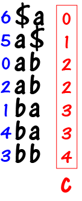

# Data Structures and Algorithms

Data Structures and algorithms are one of the most important topics in computer science where you learn to solve problems with optimized algorithms that take as little time as possible. It is the study to making algorithms and thinking of optimized solutions that takes less memory and less time.

This note will covers the following topics-

1. Mathematics
2. Bit Manipulation
3. Recursion
4. Arrays
5. Searching
6. Sorting
7. Matrix
8. Hashing
9. Strings
10. LinkedList
11. Stack
12. Queue
13. Deque
14. Tree
15. Binary Search Tree
16. Heap
17. Graph
18. Greedy
19. Backtracking
20. Dynamic Programming
21. Trie
22. Segment and Binary Indexed Tree
23. Disjoint Set

## 6. Sorting

In this section, I will discuss about the sorting techniques. Each technique is used in certain situations and gives good result when used. Some of them has higher time complexity some of them has lower.

But, there are 2 factors that you will hear frequently when going through the sorting algorithms - Inplace, Stable.

- Inplace - sorting is performed on the original array or new sorted array is returned.
- Stable - Same values are ordered in the exact previous order or not.

## Insertion Sort

Insertion sort is a stable sort and an inplace algorithm that changes the original array without returning any sorted array.

The best way to describe this algorithm is by card shifting. When you have cards in your hand and you have some way to know which comes before the other one. You go through the cards from left to right. When you encounter a card that is smaller than the previous card, you start shifting the bigger cards to the right of this smaller card untill you find a card that is same or less than the smaller card on it's left side.

### Merge Sort

## 9. Strings

### Suffix Array

#### What is a suffix array.

Consider a string `s`.


Let's write all its suffixes in lexicographical order. We get this an array of strings.


This sequence of suffixes is called the `suffix array`. How will we store it? If you store it as strings, then it will occupy $O(n^2)$ memory. To keep it smaller, let's notice that the suffix can be identified by the index of the first character. In our example, suffixes will have these numbers.


We will store the suffix array as an array `p` of suffix numbers in sorted order. Then it will occupy $O(n)$ memory. Now our first task is this: given the string `s`, build an array `p`.

To make the algorithm simpler, we will make some preparations. First, add the symbol `$` to the end of the string. This will be a special character that is smaller than all characters in the string. As a result, the symbol `$` will be added to each suffix. Let's notice that the order of the strings has not changed, because `$` is smaller than all characters.


Now let's make the length of all the strings the same. To do this, let's write after `$` all the other characters in the string in a cycle. Again, note that order of strings has not changed, because the characters after `$` do not affect the string ordering.


Now the last preparation. Let's make the length of the strings the power of two, for this we add more characters in a cycle until the length of the string becomes a power of two. In our example, the string length is 7, so we need to add one character.


#### Algorithm Idea

We will build this table by columns, each time increasing the number of columns twice. That is, first we construct the first column, then the first two, then four, and so on. In other words, we divide the algorithm into $logn$ iterations, and on the iteration `k` we construct an array consisting of the strings $s[i..i+2^k−1]$, sorted in lexicographical order (we assume that the string is cyclic, that is, the character with index i corresponds to the character with index `i mod n` of the original string).

Let's start from the base, if `k=0`, then we need to sort the strings of one character $s[i..i]$. This can be done by any sort in $O(nlogn)$.

Now make the transition from `k` to `k+1`. We need to sort the strings of length $2^{k+1}$, using the order of the strings of length $2^k$. To do this, let's learn how to quickly compare strings of length $2^{k+1}$. Suppose we have two strings **A** and **B**, both have lengths $2^{k+1}$. Let's divide both strings into two halves, then each half has a length $2^k$.

Let's compare their left halves. If they are not equal, for example, if `A.left` is less than `B.left`. This means that they have some common prefix, and after it comes a character that is not equal, and this character in the string **A** is less than in the string **B**. In this case, the entire string **A** is less than the string **B**, and the right halves should not be compared.


If the left halves are equal, then let's compare the right halves. Suppose, for example, `A.right` is less than `B.right`. This again means that there is a common prefix, and then a character that is less in the string **A** than in the string **B**. Again we get that the string **A** is less than the string **B**.


Thus, we get that `A<B⟺A.left<B.left OR (A.left=B.left AND A.right<B.right)`. If we learn to quickly compare strings of length $2^k$, then we will make a comparator that quickly compares strings of length $2^{k+1}$.

Now we need to learn how to compare strings of length $2^k$ quickly. We will do it as follows. Let's go through the strings of length $2^k$ in sorted order, and assign them integer numbers so that a smaller string corresponds to a smaller number. We call these numbers **equivalence classes**. Now, instead of comparing strings, we will compare their equivalence classes. Thus, we can compare strings of length $2^{k+1}$ in $O(1)$.

For example, for the string that we analyzed above, for `k=1` we get the following order of strings of length 2. Let's go through these strings and assign them equivalence classes (array **c**).



Now, if, for example, we want to compare the strings abab and abba. Divide them into two halves and write the equivalence classes for each of the halves, get the pair `(2,2)` for the string `abab`, and the pair `(2,3)` for the string `abba`. Now compare these pairs, we get that `(2,2)<(2,3)`, which means that `abab < abba`.

#### Algorithm

Thus, we get the following algorithm. First, we form strings of one character and sort them by any sort algorithm in $O(nlogn)$. Next, logn times we make the transition from `k`
to `k+1`. Each transition is done like this: take sorted strings of length $2^k$, assign equivalence classes to them, then assign to each string of length $2^{k+1}$ a pair of numbers: equivalence classes of its halves, sort these pairs and get a sorted order for a string of length $2^{k+1}$.

The time complexity this algorithm will be $O(nlog2^n)$, because on at each of the $logn$
iterations we do the sorting in $O(nlogn)$ time.

```c++
int main() {
  string s;
  cin >> s;
  s += '$';
  int n;
  n = s.size();

  // p -> suffix array int, c -> equivalence class
  vector<int> p(n), c(n);

  // 1. k = 0:
  // sort characters with length 1
  // create array p that contains initial suffix array integers

  // single character
  vector<pair<char, int>> a(n); // (s[i], i)
  for (int i = 0; i < n; i++)
      a[i] = {s[i], i};

  sort(a.begin(), a.end());

  for (int i = 0; i < n; i++)
      p[i] = a[i].second;

  // calculate the equaivalenve class for each s[i..i+2^k-1]
  c[p[0]] = 0;
  for (int i = 1; i < n; i++)
  {
      if (a[i].first == a[i - 1].first)
      {
          c[p[i]] = c[p[i - 1]];
      }
      else
      {
          c[p[i]] = c[p[i - 1]] + 1;
      }
  }

  // strings with 2^k length
  int k = 0;
  while ((1 << k) < n)
  {
      // k -> k+1
      vector<pair<pair<int, int>, int>> x(n);
      for (int i = 0; i < n; i++)
      {
          x[i] = {{c[i], c[(i + (1 << k)) % n]}, i};
      }

      sort(x.begin(), x.end());

      for (int i = 0; i < n; i++)
          p[i] = x[i].second;

      c[p[0]] = 0;
      for (int i = 1; i < n; i++)
      {
          if (x[i].first == x[i - 1].first)
          {
              c[p[i]] = c[p[i - 1]];
          }
          else
          {
              c[p[i]] = c[p[i - 1]] + 1;
          }
      }

      k++;
  }

  for (int i = 0; i < n; i++)
  {
      cout << p[i] << " " << s.substr(p[i], n) << "\n";
  }

  return 0;
}
```

## 17. Graphs

### Introduction to Graph

Tree is a non-linear data structure which represents hierarchy, it uses parent-child relationship to represent the hierarchy.

Now, consider a friendship relation, there are cycles between the friends, one friend is friend of another. In this case, we can't use tree to represent such structure. We cannot use trees when we have random connections among the nodes.

For this kind of relationship, we use graph data structure where random relations are allowed.

Graph is represented by a pair of sets: $G = (V, E)$.
$V$ is the set of vertices of the graph. $E$ is the set of edges in the graph.

Edges are represented with pairs of vertices $(v_i, v_j)$.

### Directed and Undirected Graph

There are 2 types of graphs - Directed and Undirected graphs.

Directed graphs has a certain order in the edges. $(v_i, v_j)$ means there is a directed edge from $v_i$ to $v_j$ and we can't go to $v_j$ from $v_i$ if no such edge is mentioned.

But, in undirected graph $(v_i, v_j)$ means we can go to $v_j$ from $v_i$ and to $v_i$ from $v_j$.

Examples: Social network follows undirected graph concept as one is a friend of another then it could be other way around as well. World wide web is an example of directed graph as one page leads to another page only.

### Degree of a vertex

In undirected graph, degree of a vertex is considered to be the number of edges passing through that vertex.

For a graph with set of edges: $E = (v_1, v_2), (v_1, v_3), (v_2, v_4), (v_3, v_4), (v_3, v_5), (v_4, v_5)$. Degrees of vertices $v_1, v_3$: $degree(v_1) = 2$, $degree(v_3) = 3$.


For directed graph, there are 2 types of degrees: InDegree, OutDegree.

- InDegree: Edges coming towards the vertex.
- OutDegree: Edges going out of the vertex.


Some observations:

1. In directed graph, sum of indegrees is total no of edges and sum of outdegrees is also total no of edges. Every edge either contributes as indegree or outdegree for any of the vertices.
2. Maximum no of edges possible in a directed graph $V*(V-1)$(Not considering self-loops). Every vertex is connected to $V-1$ vertices maximum.
3. In undirected graph, sum of degrees is $2 * V$.
4. Maximum no of edges possible in a undirected graph $V*(V-1) / 2$(Not considering self-loops).

### Walk, Path, Cyclic and Acyclic

- **Walks**: Sequence of vertices that we can get by following the edges. From the diagram: $v_1, v_2, v_4, v_2$ is a walk. $v_1, v_5$ is not a walk as there is no edge b/w $v_1$ to $v_5$. In some cases it is mentioned as path.
- **Path**: Special kind of walk where no vertex is repeated. $v_1, v_2, v_4$ is a path. In some cases, it is mentioned as simple path.
- **Cyclic**: If there exists a walk that begins and ends with the same vertex.
  
- **Acyclic**: There exists no such walk that ends and begins with the same vertex.

### Weighted graphs

If the edges of a graph has weights associated with them, then the graph is called weghted graph.

### Graph Representation

Graph can be represented in many ways but there 2 most popular ways that we will discuss here. They are - `adjacency matrix` and `adjacency list`.

**Adjacency Matrix**:

Adjacency matrix is a matrix with values 0/1. Matrix is `V x V` matrix where `V` is the number of vertices in the graph.

If there is an edge from $i$ to $j$ then $V_{ij} = 1$ otherwise it is 0.

If there are no self-loops then all diagonal elements in the matrix are 0.

For undirected graph, adjacency matrix is symmetric, as edge from $i$ to $j$ also means edge from $j$ to $i$.


For directed graph, the matrix may not be symmetric.

_Special case when the vertex are not numbers but strings_

In that case, we need additional data structures. We can store the strings in an array and represent the strings with the index in that array.

In some cases, we may need reverse mapping as well. Like cities near "Kolkata", then we need hash as well to quickly get back the index. After getting the index, search for neighbouring cities from matrix on the same row, then use those indices to get the city names from the array.

_Time and Space Complexity_:

Space: $\theta(VXV)$

Operations:

1. Check if u and v are adjacent: $\theta(1)$. We just need to check $v_{ij}$ is 1/0.
2. Find all vertices adjacent to u: $\theta(V)$. We need to check the row of vertex V, which is a linear time operation.
3. Find degree of a vertex u: $\theta(V)$. Go through the row to check how many edges are connected.
4. Add/remove edges from a vertex u to v: $\theta(1)$. Just replace 1 by 0 for the cell `[u, v]`.
5. Add/remove vertex from a graph: $\theta(V*V)$. Make a matrix with 1 more/less row-column and then copy the vertices with new vertex edges/without deleted vertex edges.

**Adjacency List**:

There are certain issues with the adjacency matrix like redundant information. Adjacency matrix not only stores edges connected to it, but also edges not connected to it. Also it makes it difficult to traverse the adjacent vertices of a vertex, which is a very common operation in graph, as it takes linear time.

Adjacency list instead stores only the information that is needed for a edge. For every vertex it stores only the edges that are connected to it in a list.

Adjacency list representation is an array of lists, where lists are most popularly represented by - dynamic sized arrays, linked lists.

We are mainly using dynamic sized array because of their cache-friendlyness. Although there are some disadvantages like waste of memory incase the size is doubled due to addition of extra elements. Usually adding an item takes constant time, but due to doubling the size it may have to copy the array again.


_Time and Space Complexity_:

Space: $O(V+E)$ for directed graph, $O(V+2*E)$ for undirected graph.

Operations:

1. Find if there is an edge b/w u to v: $O(V)$.
2. Find all adjacent of edge u: $\theta(degree(u))$.
3. Find degree of u: $\theta(1)$.
4. Add an edge: $\theta(1)$.
5. Remove an edge: $O(V)$.
