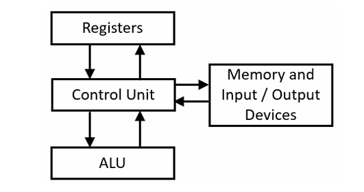
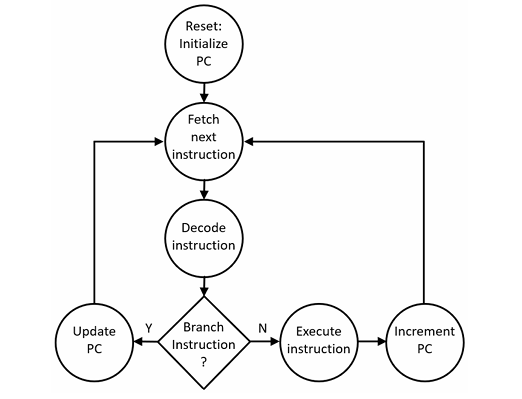

# Computer Organization and Architecture

## Difference between Computer Architecture and Organization

**Computer architecture** is the structure and behaviour of a computer as viewed by an user who uses machine or assembly language to program the computer. An assembly programmer needs to be aware about the computers processor (its instruction sets), its instruction formats, how to access stored data from the memory, how to perform input/output operations etc. Computer architecture gives them the external view of those things of that computer.

On the other hand, **computer organization** is about how the computer hardware works and how they are connected together to make the computer work. It shows how computer components operate and interact with each other while executing a program. Essentially, it is the internal view of a computer and the roles that the internal components play at program execution.

If we look at it from top to bottom, then the top-most will be *application program* that is written in any high-level language like C++, Java or Python. Application program is machine independent, then this program is converted to machine dependent code by compiler which is a *system program*. System programs direcly interact with computer harwares so they are built for a specific computer architecture. 

Computer architecture is like a contract between system engineer and hardware designer. If a system engineer want to program something, he has to use the computer architecture. A hardware designer implements the computer architecture to come at a certain computer organization.

## Bit and Byte

The smallest unit of information in a digital system is **bit**. A bit is binary which holds either of the two values 0 or 1. A number of bits are placed together to represent larger range of values. A **byte** is composed of 8 bits together to form a value. The byte is the smallest unit of information that be read from or written to by most modern processor.

## 6502 microprocessor

6502 is a famous processor that was used in console games like atari and such. It has word length of 8-bit. It means it access memory by reading or writing 8 bits to register or memory. It has 16 bit memory bus, which enables it to access 64KB memory.

The processor contains 5 8-bit registers - A, X, Y, S and P. A register works as the accumulator for arithmetic operations. X and Y can be used as index registers in calculating memory addresses. Another register is there which is 16-bit. It is the PC register. It is the program counter that points to the next instruction to be executed by the processor. Because of 16-bit size it can access all the memory addresses in 6502 microprocessor. Every instruction has 1-byte opcode, another 2 bytes optional operands depending on the type of instruction.

The S register is the stack pointer. It points to memory address of range $0100 to $01FF. The stack memory of 256-bytes is used for temporary storage of parameters in subroutines, stores the return address when a subroutine is called.

To learn more about the instruction set, go visit this [site](http://www.6502.org/users/obelisk/6502/instructions.html).

If you want to emulate the 6502 microprocessor instructions, use this [easy 6502 by skilldrick](https://skilldrick.github.io/easy6502/).

## Processor Elements

Following processor elements are the ones we are learning -

- a simple processor
- instruction set
- addressing modes
- instruction categories
- interrupt processing
- input/output operations

### A simple processor

The integrated circuit at the core of a computer is known as **central processing unit** (CPU), microprocessor or simply processor. A microprocessor is the single integrated circuit that implements the functions of the processor.

A typical processor has three logically distinct functional units -

- **Control unit** manages the overall operation of the device. It executes the next instruction, decoding the instruction to determine the operation to perform, and distributing the execution of the instructions to appropriate elements.
- **Arithmetic logic unit**(ALU) is a combinational circuit that does arithmetic operations and bit manipulation operations.
- **Register set**: provides temporary storage as well as source and destination locations for instruction inputs and outputs.

The following diagram shows the connection between control unit, ALU, registers and memory input/outputs -

### Control Unit

Control unit interpret the processor instructions and manage their execution by calling other functional components of the processor and also using memory which is an external element.

Memory here refers to *Random Access Memory*(RAM). Here memory components could be keyboard, mouse, speaker, microphone, disk, graphical video displays. It could also be other common I/O devices like network interfaces, Wi-Fi and Bluetooth.

When a computer is powered on, it resets all internal components to a defined value. Then the CPU loads the **Program Counter**(PC) register with the memory location of the first instruction. Software engineers who write the lowest level software systems must configure their developement tools to produce a *code memory* that begins execution at the address required by the processor architecture.

> "code memory" is the segment where the processor instructions are stored.

**How control unit uses program counter?** 

*PC* is a central component of the control unit. The *PC* register contains memory of the next instruction to be executed. Control unit will read the instruction from the memory indicated by the *PC*, store the instruction in the internal register to decode and execute. 

Every instruction starts with an **opcode** and control unit decides what to do based on the opcode. Depending on the opcode bit pattern, it may have to read additional memory locations to retrive data needed for the instructions like memory address or operand.

**Instruction execution cycle**

As the control unit finish it's reset process; it starts the instruction execution.

1. It reads the next instruction from the memory indicated by the program counter.
2. It stores the instruction in internal register and decodes it.
3. Checks whether it is a branch instruction.
4. If it is a branch instruction, then it will update the PC. Otherwise, it will execute the instruction and increment PC.

Following diagram illustrates the cycle:

Instructions are divided into 2 parts - branching instructions and all other instructions. 

Branching instructions are the conditional branching (when the branch is taken), unconditional branching (*jump* statement), subroutine calls, subroutine returns etc. Branching instructions cause the contents of the PC to be replaced by the memory address of the branch statement.

The steps in executing the instruction includes reading from register/writing to a register, reading from a memory/writing to a memory, directing the ALU to perform mathematical operations or some other miscellanious activities.

In most processor, the execution of an instructions takes several clock cycles to finish. Depending on the complexity of the task, it may take small number of clock cycles or more numbers of clock cycles.

### Example

We can see how the instruction is executed with a simple example. There are two types of instructions - *TXA*, *TYA*. They are used to copy the data from X and Y register to A register respectively.

It happens through a multiplexer who selects any of the register between X and Y dependind on the **Select** bit, and copy that data to A register.

Here are the 3 steps that it follows -

1. The control unit first sets the **Select** input to directs the X register data bits to the output of the multiplexer. This presents the X data bits at the input of the A register.
2. After the **Select** input is set, control unit needs to pause for the propagation of the data bits to multiplexer outputs.
3. After the multiplexer output bits have stabilized, control unit will generate a rising edge of the **CLK** signal to load the data bits into A register.